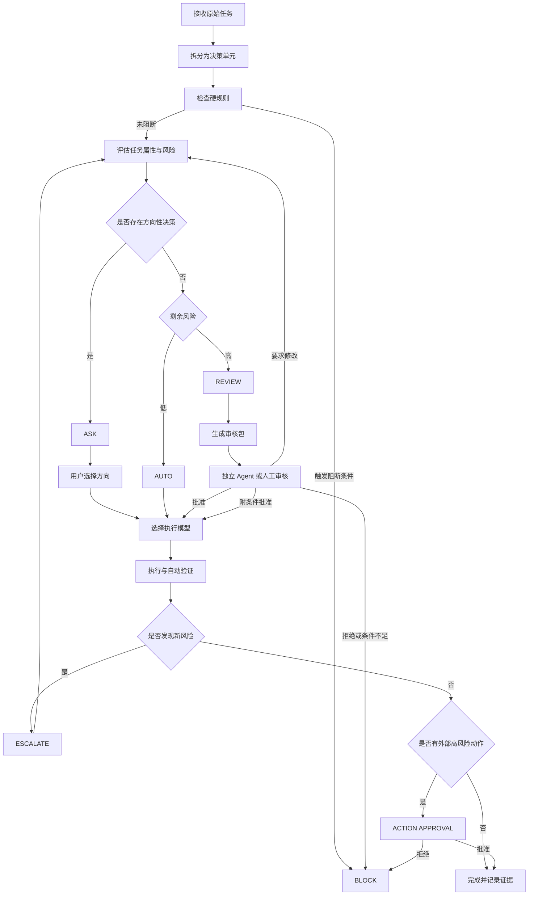

# AI 代码协同分流与模型路由设计

> 版本：V0.1  
> 目的：建立一套适用于 AI 代码协同的任务分流、模型选择、人工审核与风险控制框架。  
> 当前阶段：概念设计与规则梳理，具体评分公式、权重和实现方式后续确定。

---

## 目录

- [1. 文档目标](#1-文档目标)
- [2. 总体设计思想](#2-总体设计思想)
- [3. 基本分流单位：决策单元](#3-基本分流单位决策单元)
- [4. 分流模式](#4-分流模式)
  - [4.1 AUTO：受约束的自动执行](#41-auto受约束的自动执行)
  - [4.2 ASK：压缩决策空间后询问](#42-ask压缩决策空间后询问)
  - [4.3 REVIEW：结构化人工或独立 Agent 审核](#43-review结构化人工或独立-agent-审核)
  - [4.4 BLOCK：当前条件下禁止执行](#44-block当前条件下禁止执行)
  - [4.5 ESCALATE：执行过程中动态升级](#45-escalate执行过程中动态升级)
- [5. REVIEW 审核机制](#5-review-审核机制)
  - [5.1 审核包的必要性](#51-审核包的必要性)
  - [5.2 审核包内容](#52-审核包内容)
  - [5.3 两阶段审核](#53-两阶段审核)
  - [5.4 代码批准与动作批准](#54-代码批准与动作批准)
  - [5.5 审核角色独立性](#55-审核角色独立性)
  - [5.6 审核结果](#56-审核结果)
  - [5.7 审核版本绑定](#57-审核版本绑定)
- [6. 分流依据](#6-分流依据)
  - [6.1 任务固有属性](#61-任务固有属性)
  - [6.2 错误后果属性](#62-错误后果属性)
  - [6.3 可控制与可验证属性](#63-可控制与可验证属性)
  - [6.4 模型属性](#64-模型属性)
  - [6.5 经济属性](#65-经济属性)
- [7. 模型信任度设计](#7-模型信任度设计)
  - [7.1 为什么需要模型信任度](#71-为什么需要模型信任度)
  - [7.2 信任度不是模型总排名](#72-信任度不是模型总排名)
  - [7.3 条件信任度](#73-条件信任度)
  - [7.4 信任度的数据来源](#74-信任度的数据来源)
  - [7.5 按角色拆分信任度](#75-按角色拆分信任度)
  - [7.6 信任度的动态更新](#76-信任度的动态更新)
  - [7.7 信任度的局限](#77-信任度的局限)
- [8. 分流判定与模型选择应分成两个阶段](#8-分流判定与模型选择应分成两个阶段)
- [9. 不同分流模式下的模型选择](#9-不同分流模式下的模型选择)
  - [9.1 AUTO 的模型选择](#91-auto-的模型选择)
  - [9.2 ASK 的模型选择](#92-ask-的模型选择)
  - [9.3 REVIEW 的模型选择](#93-review-的模型选择)
- [10. 总成本而非单次调用价格](#10-总成本而非单次调用价格)
- [11. 分流公式的设计方向](#11-分流公式的设计方向)
  - [11.1 不建议直接使用单一加权总分](#111-不建议直接使用单一加权总分)
  - [11.2 建议采用硬规则与评分模型结合](#112-建议采用硬规则与评分模型结合)
  - [11.3 剩余风险概念](#113-剩余风险概念)
- [12. 任务运行流程](#12-任务运行流程)
- [13. 建议的数据结构](#13-建议的数据结构)
- [14. 最小可行版本](#14-最小可行版本)
- [15. 后续需要继续设计的问题](#15-后续需要继续设计的问题)
- [16. 核心原则汇总](#16-核心原则汇总)

---

## 1. 文档目标

本设计用于规范人类与多个 AI 模型协同完成代码任务的过程，主要解决以下问题：

1. 哪些任务可以由 AI 自动执行；
2. 哪些任务需要用户进行方向选择；
3. 哪些任务必须由人或独立审核 Agent 审查；
4. 不同任务应分配给哪个模型；
5. 为什么某些任务值得使用价格更高的模型；
6. 如何减少人工重复阅读全部上下文的负担；
7. 如何在保持开发效率的同时，提高代码正确性、可追溯性和可恢复性。

本体系的重点不是增加尽可能多的审批，而是把人工注意力集中在高价值决策上，将低风险、可验证、可恢复的工作交给 AI 自动完成。

---

## 2. 总体设计思想

整个体系由两个相互关联但需要分开处理的问题组成：

### 问题一：需要多少人工介入

根据任务风险和决策性质，将具体决策单元分流到：

- `AUTO`
- `ASK`
- `REVIEW`
- `BLOCK`

执行过程中允许通过 `ESCALATE` 动态升级。

### 问题二：由哪个模型承担哪个角色

在分流模式确定后，再为不同角色选择模型，例如：

- 规划模型；
- 实现模型；
- ASK 选项生成模型；
- 审核包生成模型；
- 独立审核模型；
- 验证模型。

总体目标是：

> 在满足可靠性、权限、安全性和时效要求的前提下，选择预期总成本最低的协同方案。

这里的“总成本”不仅包括模型调用费用，还包括人工审核、返工、等待以及错误可能造成的损失。

---

## 3. 基本分流单位：决策单元

分流对象不应是整个任务，而应是任务中的具体决策或操作。

同一个任务中可能同时包含：

```text
任务：增加代码仓库自动同步功能

AUTO
- 创建普通目录
- 格式化代码
- 运行已有测试
- 生成日志文件

ASK
- 选择冲突处理策略
- 选择备份保留周期
- 选择本地优先或远端优先

REVIEW
- 自动覆盖已有文件
- 自动执行 git push
- 删除旧备份
- 修改密钥与鉴权逻辑
```

如果对整个任务只设置一个等级，会产生两种问题：

1. 全部设为 `REVIEW`，人工审核负担过重；
2. 全部设为 `AUTO`，关键风险动作可能被一并放行。

因此，建议将最小分流单位定义为 **决策单元（Decision Unit）**。

每个决策单元至少包括：

```yaml
decision_unit:
  id: DU-001
  objective: 要实现的具体目标
  inputs: 使用的输入
  planned_action: 准备执行的动作
  affected_scope: 影响范围
  reversibility: 是否容易恢复
  verification: 如何验证
  route: AUTO / ASK / REVIEW / BLOCK
```

---

## 4. 分流模式

### 4.1 AUTO：受约束的自动执行

`AUTO` 表示 AI 可以在明确权限边界内自主执行，不需要逐项征求人类批准。

AUTO 不代表“任务不重要”或“AI 可以随便处理”，而表示该决策单元满足以下基本条件：

- 目标和边界明确；
- 错误后果较低；
- 结果容易自动验证；
- 操作可恢复；
- 不涉及不可接受的外部副作用；
- 当前模型对该类任务的信任度达到要求。

AUTO 应当具有明确护栏，例如：

```yaml
mode: auto

scope:
  allowed_files:
    - src/utils/**
    - tests/**
  forbidden_files:
    - .env
    - secrets/**
    - .github/workflows/**

allowed_actions:
  - read
  - edit
  - create
  - run_tests

forbidden_actions:
  - delete
  - network_access
  - install_dependency
  - git_push

verification:
  - unit_tests
  - lint
  - type_check

rollback:
  - git_restore
```

AUTO 即使不要求人工审核，也应保留轻量审计记录：

- 执行了什么；
- 修改了哪些文件；
- 为什么被判定为 AUTO；
- 使用了哪个模型和推理档位；
- 执行了哪些验证；
- 最终结果是否通过；
- 是否发生过动态升级。

---

### 4.2 ASK：压缩决策空间后询问

`ASK` 适用于存在方向性、偏好性或多种合理方案的任务。

ASK 的目标不是把开放问题重新甩给用户，而是由 AI 先完成分析，将决策空间压缩为 2—4 个有实际差异的选项。

不推荐：

```text
你希望我怎么实现？
```

推荐：

```text
检测到同步冲突，可以采用以下方案：

A. 本地版本优先
优点：适合本机始终作为主版本。
风险：可能覆盖远端更新。

B. 冲突时停止并生成报告（推荐）
优点：不自动覆盖任何内容，安全性最高。
代价：需要后续人工处理冲突。

C. 按修改时间自动选择
优点：自动化程度高。
风险：时间戳不一定代表真实内容的新旧。

D. 同时保留两个版本
优点：不会丢失数据。
代价：后续需要人工整理。
```

高质量 ASK 应满足：

- 选项数量通常为 2—4 个；
- 各选项必须具有实质差异；
- 说明每个选项的收益、代价和风险；
- 可以给出推荐项，但不能伪造唯一正确答案；
- 用户完成选择后，AI 可以继续执行；
- 不要求用户阅读完整代码库或历史对话。

ASK 可以进一步分为：

#### 方向选择型 ASK

用户决定目标或取舍，例如：

- 性能优先还是可维护性优先；
- 保持兼容还是允许破坏性升级；
- 本地优先还是远端优先。

#### 偏好选择型 ASK

不存在明显技术对错，主要影响使用体验，例如：

- 报告输出 Markdown、HTML 还是 JSON；
- 日志保留 7 天、30 天还是永久；
- 是否在每次执行后弹出通知。

ASK 的核心触发因素是“存在多种合理方向”，而不仅仅是风险处于中间水平。

---

### 4.3 REVIEW：结构化人工或独立 Agent 审核

`REVIEW` 适用于以下情况：

- 错误后果严重；
- 任务不可逆或难以恢复；
- 涉及生产环境、真实数据、权限或密钥；
- 需求或架构方向对后续影响较大；
- 自动验证不足以证明正确性；
- 模型对该类任务信任度不足；
- 操作影响范围较大；
- 错误可能长期潜伏，难以及时发现。

REVIEW 不应简单理解为“把代码交给人逐行阅读”。

更合理的方式是：

> AI 先生成最小充分上下文和结构化审核包，审核者在理解任务目的、代码结构、变更内容、风险和验证证据后，再做高价值判断。

---

### 4.4 BLOCK：当前条件下禁止执行

有些情况不适合进入普通审核，应直接阻止执行，例如：

- 删除范围不明确；
- 无法确认目标仓库或生产环境；
- 操作不可逆且没有备份；
- 凭据可能被发送到外部；
- 验证工具不可用；
- 指令之间存在明显冲突；
- 审核材料不完整；
- 当前模型无权执行相应动作；
- 操作违反明确的安全规则。

`BLOCK` 的含义是：

> 当前缺少安全执行所必需的信息、权限或保护措施。

只有在阻断条件解除后，任务才能重新进入分流流程。

---

### 4.5 ESCALATE：执行过程中动态升级

初始分流不是永久标签。执行过程中发现新情况时，必须允许风险等级升级。

例如：

```text
初始判断：
只修改一个配置文件，分流为 AUTO。

执行中发现：
该配置文件由多个构建脚本动态生成，并影响远程部署。

处理：
AUTO → REVIEW
```

建议遵循：

- `AUTO` 可以升级为 `ASK` 或 `REVIEW`；
- `ASK` 可以升级为 `REVIEW`；
- `REVIEW` 可以升级为 `BLOCK`；
- 执行 Agent 可以自动升级；
- 执行 Agent 不得自行降低已确定的风险等级。

典型升级信号包括：

- 修改范围超出预期；
- 连续多次测试失败；
- 需要新增依赖；
- 需要访问网络或凭据；
- 发现多个合理实现方向；
- 无法给出可靠验证方法；
- 模型对关键结论表示明显不确定；
- 现有备份或回滚机制失效；
- 实际任务与最初描述不一致。

---

## 5. REVIEW 审核机制

### 5.1 审核包的必要性

人工审核的主要困难不是缺少代码，而是缺少经过整理的上下文。

如果审核者需要重新阅读：

- 全部聊天记录；
- 整个仓库；
- 所有中间方案；
- 大量无关文件；
- 实现 Agent 的完整推理过程；

那么审核成本会快速上升，最终容易退化为形式批准。

因此，REVIEW 前应生成 **审核包（Review Package）**。

审核包的目标是：

> 只提供完成本次审核所必需的关键知识，使审核者能够快速建立正确的心智模型。

---

### 5.2 审核包内容

审核包建议至少包含以下内容。

#### 1. 审核目标

明确本次审核者需要判断什么。

不推荐：

```text
请审核这段代码。
```

推荐：

```text
本次审核需要确认：
自动同步脚本是否可能覆盖尚未提交的本地修改，以及当前备份策略是否足够可靠。
```

#### 2. 功能背景

简要说明：

- 这一部分在系统中负责什么；
- 为什么需要修改；
- 修改前是什么行为；
- 修改后预期是什么行为。

背景应保持简洁，不需要复述全部项目历史。

#### 3. 代码地图

说明关键文件、模块和函数分别做什么。

```text
sync.ps1
- 同步流程主入口
- 读取配置并调用冲突检测

Compare-File.ps1
- 比较文件哈希
- 返回 same、local-newer、remote-newer 或 conflict

Backup-File.ps1
- 覆盖前创建时间戳备份

config.json
- 定义同步目录和冲突策略
```

同时明确本次修改涉及的位置：

```text
本次主要修改：
- sync.ps1：新增 Resolve-Conflict 函数
- config.json：新增 conflict_policy 配置
- tests/sync.Tests.ps1：增加冲突和备份测试
```

#### 4. 语义变更摘要

不能只提供原始 diff，还应解释行为发生了什么变化。

```text
修改前：
目标文件存在时直接覆盖。

修改后：
1. 先比较文件哈希；
2. 内容相同则跳过；
3. 内容不同则先创建备份；
4. 根据配置决定停止、覆盖或保留双份；
5. 所有冲突写入日志。
```

#### 5. 风险说明

实现 Agent 应主动暴露自己识别出的风险：

- 时间戳可能不可靠；
- 备份目录可能持续增长；
- 网络中断可能造成半写入；
- 路径处理可能存在系统差异；
- 日志可能包含敏感路径；
- 测试环境与真实环境不完全一致。

#### 6. 验证证据

应说明：

- 已经验证了什么；
- 使用了哪些测试和工具；
- 哪些结果通过；
- 哪些场景尚未覆盖；
- 如何回滚。

示例：

```text
已验证：
- 同名同内容文件会跳过；
- 新文件能够正常复制；
- 冲突文件会生成备份；
- 备份失败时不会覆盖原文件。

尚未验证：
- 网络盘突然断开；
- 10,000 个以上文件的性能；
- Linux 环境兼容性。
```

#### 7. 明确审核问题

将审核者需要回答的问题限制在高价值判断上：

```text
请重点确认：

1. 冲突判断规则是否符合预期？
2. 覆盖前备份是否足够可靠？
3. 是否允许脚本自动执行 git push？
4. 当前回滚方案是否可以接受？
```

#### 8. 推荐结论

AI 可以给出推荐，但必须同时展示理由和剩余不确定性：

```text
建议：APPROVE_WITH_CONDITIONS

条件：
- 首次运行必须使用 dry-run；
- 默认冲突策略设为停止；
- git push 保持人工确认。
```

---

### 5.3 两阶段审核

高风险任务最好区分两类审核。

#### DESIGN REVIEW：实现前审核

审核内容：

- 需求理解；
- 技术方向；
- 架构设计；
- 数据流；
- 修改范围；
- 权限边界；
- 失败处理；
- 回滚策略；
- 是否存在不可接受的副作用。

主要防止：

> 实现本身正确，但整个方向错误。

适用于：

- 大规模重构；
- 数据迁移；
- 新增外部依赖；
- 修改鉴权；
- 自动化删除或覆盖；
- Git 自动推送；
- 生产部署；
- 核心数值算法调整。

#### IMPLEMENTATION REVIEW：实现后审核

审核内容：

- 实际代码是否符合批准后的设计；
- 是否加入了额外行为；
- 边界条件是否充分；
- 验证证据是否可信；
- 是否允许合并或执行。

高风险任务的完整流程可为：

```text
方案设计
→ DESIGN REVIEW
→ AI 实现
→ 自动验证
→ IMPLEMENTATION REVIEW
→ 动作批准
→ 执行或合并
```

---

### 5.4 代码批准与动作批准

应当区分：

#### CODE APPROVAL

表示代码逻辑和工程质量可以接受。

#### ACTION APPROVAL

表示允许代码在真实环境中执行具体动作。

例如：

```text
脚本代码可以合并
≠
允许脚本现在删除 200 个真实文件
```

以下行为即使代码已审核，也建议单独进行动作批准：

- 删除；
- 覆盖；
- 强制推送；
- 发布；
- 部署；
- 对外发送邮件或消息；
- 修改生产数据；
- 使用真实密钥；
- 大批量迁移；
- 调用付费或高权限外部服务。

---

### 5.5 审核角色独立性

同一个 Agent 同时承担以下全部角色时，容易延续同一个错误假设：

```text
理解需求
→ 制定方案
→ 写代码
→ 写测试
→ 解释代码
→ 审核代码
```

更稳健的角色分工是：

#### Implementer Agent

负责：

- 理解任务；
- 生成方案；
- 编写测试；
- 实现代码；
- 自检；
- 生成初步审核包。

#### Reviewer Agent

只接收必要信息：

- 原始目标；
- 批准后的规格；
- 代码地图；
- 实际 diff；
- 验证结果；
- 已知限制。

负责：

- 寻找规格缺口；
- 提出反例；
- 检查隐藏副作用；
- 质疑验证是否充分；
- 检查回滚和权限。

#### Human Reviewer

负责：

- 方向性判断；
- 风险接受；
- 权限批准；
- 业务和工程后果判断；
- 最终动作批准。

审核 Agent 不一定需要看到实现 Agent 的完整对话，以避免被原方案锚定。

---

### 5.6 审核结果

建议设置四种审核结论：

#### APPROVE

当前方案可以按计划执行。

#### APPROVE_WITH_CONDITIONS

原则上批准，但必须满足明确条件。

```text
批准，但首次运行必须使用 dry-run，且不得自动 git push。
```

#### REQUEST_CHANGES

方向可接受，但实现需要修改。

```text
备份思路可接受，但不能使用文件修改时间作为唯一冲突依据。
```

#### REJECT

方案本身不可接受。

```text
不允许脚本自动向主分支强制推送。
```

必要时还可使用：

#### BLOCKED

由于信息、权限或验证条件不足，暂时无法完成审核。

---

### 5.7 审核版本绑定

审核结论必须绑定具体代码版本。

```yaml
review:
  task_id: SYNC-014
  repository: ai-agent-dotfiles
  branch: feature/conflict-resolution
  commit: a8c3f4d
  diff_base: 27b19e1
  generated_at: 2026-08-01T15:20:00+08:00
```

审核完成后，如果代码发生变化：

- 仅格式或注释变化：可自动重新验证；
- 行为性变化：必须重新审核；
- 修改范围扩大：重新分流；
- 新增权限、依赖或外部副作用：至少升级到 REVIEW。

---

## 6. 分流依据

任务难度和模型信任度是核心变量，但不能独立决定分流。

完整分流至少应考虑以下五组因素。

---

### 6.1 任务固有属性

#### 1. 任务难度

描述任务本身需要多少能力，包括：

- 推理步骤数量；
- 是否跨文件、跨模块或跨仓库；
- 是否涉及复杂状态；
- 是否包含并发、异步、缓存；
- 是否需要专业知识；
- 边界条件数量；
- 是否需要长期规划；
- 是否涉及复杂数值算法。

任务难度主要影响出错概率。

#### 2. 需求明确程度

需求越含糊，AI 越难判断正确目标。

例如：

```text
优化一下这个程序。
```

可能指：

- 提高速度；
- 降低内存；
- 简化代码；
- 提高数值精度；
- 改善可维护性。

需求含糊通常应触发 ASK，而不是直接执行。

#### 3. 方向性

如果存在多种合理方向，并且不同方向对应不同目标或取舍，则应触发 ASK。

典型方向包括：

- 性能与可维护性的取舍；
- 向后兼容与彻底重构的取舍；
- 本地优先与远端优先；
- 使用现有依赖与新增依赖；
- 自动化程度与安全性的取舍。

#### 4. 新颖性

任务越偏离模型常见训练分布或公开评测范围，公开信任度越难直接迁移。

例如：

- 特定公司的内部流程；
- MATLAB、Abaqus、COMSOL 联动；
- 自定义数值算法；
- 特殊 Git 同步机制；
- 罕见语言或框架。

#### 5. 上下文负担

包括：

- 需要阅读的文件数量；
- 调用链长度；
- 上下文是否分散；
- 是否依赖隐式约定；
- 是否需要长期历史决策；
- 是否接近模型上下文上限。

上下文负担越大，遗漏约束的可能性越高。

---

### 6.2 错误后果属性

#### 1. 任务重要性

重要性描述做错后会造成多大损失。

任务难度低并不代表风险低。例如删除生产数据可能技术上非常简单，但必须 REVIEW。

#### 2. 影响范围

可按以下层级评估：

```text
单行或局部函数
→ 单个模块
→ 整个仓库
→ 多个仓库
→ 本机环境
→ 团队环境
→ 生产环境
→ 外部用户
```

影响范围越大，越倾向 REVIEW。

#### 3. 可逆性

需要判断：

- 能否通过 Git 恢复；
- 是否存在有效备份；
- 是否支持 dry-run；
- 是否会覆盖真实数据；
- 是否会产生不可撤回的发布；
- 回滚是否经过验证；
- 回滚是否会造成二次损失。

#### 4. 安全与敏感性

以下内容通常需要硬性规则：

- 密钥、Token 和密码；
- 隐私或公司内部数据；
- 网络访问；
- Shell 或系统命令；
- 权限提升；
- CI/CD；
- 依赖供应链；
- 外部通信；
- 生产环境配置。

#### 5. 外部副作用

需要区分“生成代码”和“执行动作”。

例如：

```text
生成 git push 脚本
```

与：

```text
实际执行 git push
```

风险等级不同。

外部副作用包括：

- 修改远程仓库；
- 调用付费 API；
- 发送邮件或消息；
- 修改数据库；
- 发布或部署；
- 安装系统依赖；
- 控制真实设备。

---

### 6.3 可控制与可验证属性

#### 1. 可验证性

结果是否存在明确的正确性判据，例如：

- 单元测试通过；
- 编译成功；
- Schema 校验通过；
- 输出与基准结果一致；
- 数值误差低于阈值；
- 文件数量和哈希符合预期。

可验证性越高，越有条件进入 AUTO。

#### 2. 错误可检测性

某些错误会立即暴露：

```text
程序无法编译。
```

某些错误可能长期潜伏：

```text
仅在极端输入下覆盖用户数据。
```

越难检测的错误，越需要 REVIEW。

#### 3. 沙箱与隔离

以下措施可以降低风险：

- 临时分支；
- 临时目录；
- 容器；
- 测试数据库；
- 模拟 API；
- dry-run；
- 只读模式；
- 无网络环境；
- 最小权限环境。

#### 4. 备份与回滚能力

不仅要确认“理论上可以恢复”，还应确认：

- 备份是否实际存在；
- 备份是否完整；
- 回滚命令是否验证；
- 是否明确恢复顺序；
- 回滚是否会影响新产生的数据。

#### 5. 验证成本

部分任务虽然可以验证，但成本较高，例如：

- 长时间仿真；
- 需要真实硬件；
- 需要人工检查；
- 需要多个系统环境；
- 需要付费 API；
- 需要实验数据。

验证成本会影响分流方式和模型组合。

---

### 6.4 模型属性

#### 1. 任务专项信任度

候选模型对当前任务类型的实际可靠程度。

#### 2. 工具使用可靠性

包括：

- 是否能正确调用终端；
- 是否能正确编辑文件；
- 是否会越权操作；
- 是否能运行并理解测试；
- 是否能使用 Git；
- 是否会误用网络和外部工具。

#### 3. 指令遵循能力

模型是否能稳定遵守：

- 文件范围；
- 禁止操作；
- 输出格式；
- 审核要求；
- 测试要求；
- 不得降低风险等级等规则。

#### 4. 自我校准能力

模型是否能够：

- 承认不确定性；
- 发现自己缺少上下文；
- 识别任务超出能力；
- 在需要时主动升级；
- 不伪造测试结果和证据。

#### 5. 领域能力

例如：

- Python；
- PowerShell；
- C++；
- MATLAB；
- 前端；
- 数值算法；
- 代码审核；
- 安全分析；
- 长上下文仓库理解。

---

### 6.5 经济属性

#### 1. 模型调用成本

包括：

- 输入 Token；
- 输出 Token；
- 推理档位；
- 工具调用；
- 多轮返工；
- 并行 Agent。

#### 2. 人工决策成本

ASK 虽然调用费用不一定高，但会占用用户注意力。

#### 3. 人工审核成本

REVIEW 的成本主要取决于：

- 审核包质量；
- 代码规模；
- 风险复杂度；
- 审核者是否需要补充上下文。

#### 4. 返工成本

低性能模型可能单次便宜，但需要多次修改。

#### 5. 错误预期损失

包括：

- 数据损失；
- 延误；
- 生产事故；
- 技术债；
- 错误研究结论；
- 安全风险；
- 人工恢复成本。

---

## 7. 模型信任度设计

### 7.1 为什么需要模型信任度

模型信任度的主要作用包括：

1. 解释为什么某个任务需要使用更昂贵的模型；
2. 将任务分配给更擅长该类任务的模型；
3. 避免所有任务统一使用最高价格模型；
4. 避免简单任务被过度配置；
5. 判断何时需要第二模型或人工审核；
6. 支持动态升级；
7. 建立可审计、可迭代的模型路由依据。

模型信任度不是为了证明某个模型绝对可靠，而是为了比较不同执行方案在当前任务上的相对适用性。

---

### 7.2 信任度不是模型总排名

不建议使用单一全局分数：

```text
模型 A：92 分
模型 B：88 分
```

更合理的是任务能力矩阵：

| 模型 | 仓库理解 | Bug 修复 | 新功能 | PowerShell | 数值计算 | 代码审核 | ASK 选项 |
|---|---:|---:|---:|---:|---:|---:|---:|
| 模型 A | 0.91 | 0.88 | 0.84 | 0.82 | 0.70 | 0.86 | 0.90 |
| 模型 B | 0.83 | 0.86 | 0.89 | 0.71 | 0.92 | 0.81 | 0.85 |

模型没有绝对意义上的统一强弱，重点是模型与任务的匹配程度。

---

### 7.3 条件信任度

模型信任度应定义为：

> 某个模型在特定任务类型、推理档位、工具环境和上下文条件下，正确完成指定角色的可信程度。

因此评估对象应更接近：

```text
模型
× 任务类型
× 执行角色
× 推理档位
× 工具环境
× 上下文质量
```

例如，同一模型的以下两种配置应视为不同执行配置：

```text
普通推理档位 + 无工具 + 不完整上下文
```

```text
高推理档位 + 完整仓库 + 可运行测试
```

---

### 7.4 信任度的数据来源

建议由四部分组成。

#### 1. 外部评测先验

来源可以包括：

- 编程 Benchmark；
- Agent 工具使用评测；
- Bug 修复评测；
- 数学与推理评测；
- 长上下文评测；
- 指令遵循评测；
- 社区真实使用反馈；
- 模型速度与费用数据。

外部数据适合为新模型提供初始信任度。

#### 2. 内部历史表现

随着系统运行，逐步记录：

- 首次完成率；
- 测试通过率；
- 人工审核发现的问题数；
- 返工次数；
- 是否越权修改文件；
- 是否误用工具；
- 是否主动识别不确定性；
- ASK 选项质量；
- 审核包质量；
- 平均费用；
- 平均完成时间。

内部数据最终应逐步高于外部榜单的权重，因为它更接近真实工作场景。

#### 3. 当前任务适配度

模型的公开优势是否与当前任务匹配，例如：

- 是否擅长当前语言；
- 是否擅长仓库级修改；
- 是否擅长数学推理；
- 是否擅长 UI；
- 是否擅长审核；
- 是否适合长上下文。

#### 4. 环境修正

信任度应根据当前环境调整：

- 是否可以运行测试；
- 是否可以访问仓库；
- 是否有项目规范文件；
- 是否拥有正确工具；
- 上下文是否完整；
- 是否在沙箱中；
- 推理档位是否足够；
- 工具调用是否稳定。

概念上可表示为：

```text
条件信任度
= 外部评测先验
+ 内部历史表现修正
+ 当前任务匹配修正
+ 执行环境修正
```

具体组合方式后续设计。

---

### 7.5 按角色拆分信任度

模型在不同角色上的能力不一定一致，建议至少拆分为：

#### 实现信任度

```text
T_impl(model, task)
```

模型能否正确完成代码实现。

#### 规划信任度

```text
T_plan(model, task)
```

模型能否正确拆解任务、识别依赖和制定方案。

#### ASK 信任度

```text
T_ask(model, task)
```

模型能否：

- 识别真正需要用户决定的问题；
- 生成 2—4 个实质不同的选项；
- 说明各自取舍；
- 不遗漏关键方向；
- 避免诱导用户。

#### 审核信任度

```text
T_review(model, task)
```

模型能否发现：

- 代码缺陷；
- 规格遗漏；
- 边界问题；
- 隐藏副作用；
- 验证不足；
- 错误的风险判断。

#### 解释信任度

```text
T_explain(model, task)
```

模型能否生成准确、简明、对审核者有帮助的代码地图和审核包。

#### 工具信任度

```text
T_tool(model, environment)
```

模型能否稳定、合规地调用工具。

#### 校准信任度

```text
T_calibrate(model, task)
```

模型能否正确认识自己的不确定性，并在必要时升级。

---

### 7.6 信任度的动态更新

任务开始前的信任度只是初始值。

执行过程中出现以下情况时，应降低当前任务的实际信任度：

- 连续测试失败；
- 多次推翻原方案；
- 无法解释关键依赖；
- 修改范围不断扩大；
- 使用了未批准的依赖；
- 忽略文件边界；
- 无法生成可靠验证证据；
- 声称通过但没有真实运行；
- 对关键结论表现出明显不确定；
- 审核 Agent 发现重大缺陷。

反之，以下证据可以提高当前任务的执行信心：

- 测试首次通过；
- 变更范围严格受控；
- 所有验证可以复现；
- 独立 Agent 审核未发现重大问题；
- 与已知基准结果一致；
- dry-run 和真实运行结果一致。

动态信任度变化应触发：

```text
AUTO → ASK
AUTO → REVIEW
ASK → REVIEW
REVIEW → BLOCK
```

---

### 7.7 信任度的局限

模型信任度只能修正“模型做错的概率”，不能抵消任务本身的严重后果。

例如：

> 即使一个模型在数据库任务上的信任度很高，也不应在无备份情况下自动删除生产数据。

模型信任度不能替代：

- 权限控制；
- 数据备份；
- 沙箱；
- 自动测试；
- 人工风险接受；
- 外部动作批准。

---

## 8. 分流判定与模型选择应分成两个阶段

不建议在一次计算中同时决定分流和模型。

### 第一阶段：治理分流

先根据任务属性决定需要多少人工介入：

```text
AUTO / ASK / REVIEW / BLOCK
```

主要考虑：

- 错误后果；
- 方向性；
- 可逆性；
- 可验证性；
- 安全和权限；
- 影响范围；
- 剩余风险。

### 第二阶段：模型配置

分流确定后，再选择：

- 规划模型；
- 实现模型；
- ASK 选项模型；
- 审核包模型；
- 独立审核模型；
- 推理档位；
- 是否使用第二模型；
- 是否需要沙箱和额外工具。

这样可以避免以下循环：

```text
因为用了强模型，所以判定为 AUTO；
因为判定为 AUTO，所以又改用便宜模型。
```

---

## 9. 不同分流模式下的模型选择

### 9.1 AUTO 的模型选择

AUTO 的目标不是选择最便宜模型，而是：

> 在满足任务可靠性阈值的候选模型中，选择预期总成本最低的模型。

对于简单、可验证、可恢复的任务，可以使用高性价比模型。

例如：

- 格式化；
- 机械性重命名；
- 生成样板代码；
- 运行测试；
- 更新普通文档；
- 根据固定规则生成配置。

但复杂任务即使被允许 AUTO，也可能仍然需要高性能模型。

例如：

```text
复杂代码迁移
+ 完整测试
+ 临时分支
+ 可立即回滚
```

此时 AUTO 表示不需要人工逐项审核，不代表执行模型可以很弱。

---

### 9.2 ASK 的模型选择

ASK 的关键能力是高质量决策压缩，而不是“处于价格中间”。

ASK 模型应擅长：

- 识别需要人类决定的真实问题；
- 提供 2—4 个互不重复的方案；
- 解释取舍；
- 给出有根据的推荐；
- 避免伪选项和诱导；
- 在用户选择后准确执行。

可采用分工：

```text
高性能模型：分析问题并生成选项
高性价比模型：根据用户选择完成具体实现
```

ASK 有时比普通 AUTO 更需要强推理能力，因为错误的选项设计会把用户引向错误方向。

---

### 9.3 REVIEW 的模型选择

REVIEW 不等于所有步骤都使用最贵模型。

建议区分：

#### 实现模型

选择最擅长当前任务类型的模型。

#### 审核包生成模型

选择代码理解和解释能力强的模型。

#### 独立审核模型

选择高性能、善于找错、与实现模型具有一定独立性的模型。

#### 人类审核者

负责方向判断、风险接受和最终动作批准。

可能的组合：

```text
高性价比模型实现
+ 高性能模型审核
+ 人类批准
```

```text
高性能模型规划
+ 专项模型实现
+ 另一高性能模型独立审核
```

```text
同一模型不同会话分别实现和审核
+ 人类处理关键风险
```

高风险任务应优先追求审核独立性，而不仅是提高同一模型的推理档位。

---

## 10. 总成本而非单次调用价格

模型选择目标不应只是最低 API 价格。

概念上的总成本包括：

```text
总成本
= 模型调用费用
+ 人工决策费用
+ 人工审核费用
+ 返工费用
+ 等待时间成本
+ 错误预期损失
```

一个便宜模型反复返工，可能比高性能模型一次完成更贵。

一个高性能模型执行大量简单格式化任务，也可能浪费成本。

可比较的执行方案包括：

- 低价模型实现 + 自动测试；
- 低价模型实现 + 高性能模型审核；
- 高性能模型规划 + 低价模型执行；
- 高性能模型一次完成；
- 两个不同模型交叉验证；
- 高性能模型生成 ASK 选项 + 低价模型执行；
- 专项模型实现 + 通用高性能模型审核。

模型信任度的重要作用之一，就是为这些成本差异提供解释。

---

## 11. 分流公式的设计方向

### 11.1 不建议直接使用单一加权总分

如果将所有因素直接加权平均，可能出现不合理结果：

```text
任务涉及不可逆数据删除，风险极高；
但因为任务简单、模型很强、测试完善；
综合分被平均成中风险。
```

部分风险不应被其他优势抵消。

因此，分流不能完全依赖一个连续总分。

---

### 11.2 建议采用硬规则与评分模型结合

第一步：检查硬规则。

示例：

```text
涉及生产数据删除          → 至少 REVIEW
涉及密钥向外部发送        → BLOCK
存在多个合理业务方向      → 至少 ASK
不可逆且无备份            → 至少 REVIEW
自动部署到生产环境        → REVIEW + ACTION APPROVAL
验证工具不可用            → 不得 AUTO
审核代码版本发生实质变化  → 重新 REVIEW
```

第二步：未触发硬规则的任务进入评分模型。

评分因素可以包括：

- 任务难度；
- 需求明确度；
- 新颖性；
- 上下文负担；
- 模型专项信任度；
- 影响范围；
- 可逆性；
- 可验证性；
- 错误可检测性；
- 沙箱和备份；
- 验证成本。

---

### 11.3 剩余风险概念

建议后续公式围绕“剩余风险”设计。

概念关系如下：

```text
错误概率
← 任务难度
← 需求模糊度
← 新颖性
← 上下文负担
← 模型信任度

错误损失
← 任务重要性
← 影响范围
← 安全与敏感性
← 外部副作用
← 可逆性

风险缓解
← 自动测试
← 沙箱
← dry-run
← 备份
← 回滚
← 独立审核
← 多模型验证

剩余风险
← 错误概率 × 错误损失
← 再结合错误可检测性和风险缓解能力
```

初步分流逻辑可以表示为：

```text
剩余风险低
且没有方向性问题
且不存在硬性限制
→ AUTO

存在多个合理方向
或需要用户偏好决定
→ ASK

剩余风险较高
或自动验证不足
或后果严重
→ REVIEW

缺少必要信息、权限、备份或安全条件
→ BLOCK
```

具体公式、归一化方式、阈值和权重后续设计。

---

## 12. 任务运行流程



执行过程的核心原则是：

- 先拆分，后分流；
- 先决定人工参与程度，后选择模型；
- 低风险操作自动化；
- 方向性问题交给用户；
- 高风险问题通过审核包审查；
- 执行中发现异常自动升级；
- 外部高风险动作单独批准；
- 全流程保留证据和版本信息。

---

## 13. 建议的数据结构

### 任务记录

```yaml
task:
  id: TASK-001
  title: 增加自动同步冲突处理
  original_request: 原始需求
  repository: ai-agent-dotfiles
  branch: feature/conflict-resolution
  created_at: 2026-08-01T16:00:00+08:00
```

### 决策单元

```yaml
decision_unit:
  id: DU-003
  objective: 处理同名文件内容冲突
  difficulty: 0.55
  ambiguity: 0.35
  directionality: 0.80
  impact_scope: 0.60
  reversibility: 0.70
  verifiability: 0.75
  detectability: 0.65
  security_sensitivity: 0.20
  route: ASK
  route_reason:
    - 存在多个合理冲突策略
    - 不同策略涉及用户偏好
```

### 模型配置

```yaml
model_assignment:
  planning:
    model: model-a
    reasoning_level: high
    trust_dimension: T_plan
  implementation:
    model: model-b
    reasoning_level: medium
    trust_dimension: T_impl
  review:
    model: model-c
    reasoning_level: high
    trust_dimension: T_review
```

### 审核记录

```yaml
review:
  type: implementation_review
  commit: a8c3f4d
  diff_base: 27b19e1
  result: APPROVE_WITH_CONDITIONS
  conditions:
    - 首次运行使用 dry-run
    - 默认禁止自动 git push
  reviewer:
    type: human
```

### 验证证据

```yaml
evidence:
  commit: a8c3f4d
  tests:
    passed: 24
    failed: 0
  lint:
    errors: 0
  type_check:
    errors: 0
  dry_run:
    result: passed
  unverified:
    - 网络中断场景
    - Linux 兼容性
```

---

## 14. 最小可行版本

第一版不建议立即实现复杂评分公式和完整多 Agent 系统。

可以先建立以下最小闭环：

```text
原始任务
→ AI 拆分决策单元
→ 根据简单规则标记 AUTO / ASK / REVIEW
→ 用户确认 ASK
→ REVIEW 自动生成审核包
→ 人或独立 Agent 审核
→ AI 实现
→ 统一验证命令
→ 生成证据记录
→ 外部动作单独批准
```

第一版建议优先实现：

1. 决策单元模板；
2. AUTO、ASK、REVIEW、BLOCK、ESCALATE 状态；
3. 一组硬性分流规则；
4. ASK 的标准选项模板；
5. REVIEW 审核包模板；
6. 模型—任务类型信任度表；
7. 模型调用费用记录；
8. 执行后证据记录；
9. 动态升级机制；
10. 代码版本与审核结果绑定。

暂时可以人工维护模型信任度，不必一开始就建立复杂数据库。

---

## 15. 后续需要继续设计的问题

### 分流公式

- 因素如何归一化；
- 哪些因素采用乘法；
- 哪些因素采用加权加法；
- 如何定义剩余风险；
- AUTO、ASK、REVIEW 的阈值；
- 如何处理置信区间；
- 如何防止单个高风险因素被平均掉。

### 硬规则

- 哪些操作必须 REVIEW；
- 哪些操作必须 BLOCK；
- 哪些行为需要 ACTION APPROVAL；
- 哪些文件和目录永远不能 AUTO 修改；
- 哪些环境必须使用沙箱。

### 模型信任度

- 外部评测网站如何选择；
- 不同榜单如何标准化；
- 不同推理档位如何分别记录；
- 内部样本数量不足时如何估计；
- 如何加入时间衰减；
- 模型版本更新后是否重新初始化；
- 如何评估审核能力而不仅是实现能力。

### 模型选择

- AUTO 的可靠性最低阈值；
- ASK 是否使用高性能模型生成选项；
- REVIEW 是否要求不同模型；
- 何时采用双模型；
- 如何计算返工成本；
- 如何估算人工审核成本；
- 如何平衡速度、价格和可靠性。

### 执行过程

- 什么异常触发动态升级；
- 升级后如何保留已有成果；
- 如何避免多个 Agent 同时修改同一文件；
- 如何管理任务状态；
- 如何实现统一证据报告；
- 如何与 GitHub、Claude Code 和 Codex 集成。

---

## 16. 核心原则汇总

1. 分流对象是决策单元，而不是整个任务。
2. AUTO 是受权限、范围和验证约束的自主执行。
3. ASK 的职责是压缩决策空间，而不是把开放问题甩给用户。
4. REVIEW 前必须提供最小充分上下文和结构化审核包。
5. 审核重点是目标、风险、行为和证据，而不是机械逐行阅读。
6. 高风险任务应区分设计审核和实现审核。
7. 代码批准与真实动作批准必须分开。
8. 实现 Agent 与审核 Agent 应尽量保持角色独立。
9. 审核结论必须绑定具体代码版本。
10. 风险等级可以自动升级，但执行 Agent 不得自行降级。
11. 任务难度影响错误概率，任务后果决定错误是否可接受。
12. 可验证性、沙箱、备份和回滚可以降低剩余风险。
13. 模型信任度应是任务和角色相关的条件信任度，而不是全局排名。
14. 外部榜单用于初始化，内部真实表现应逐渐成为主要依据。
15. 分流判定和模型选择应分成两个阶段。
16. AUTO 不等于使用最便宜模型，而是在满足可靠性要求后选择最低总成本方案。
17. ASK 模型应重点考察决策压缩和选项质量。
18. REVIEW 应优先使用高性能且具有独立性的审核模型。
19. 模型选择应优化总成本，而不是单次 API 价格。
20. 最终分流公式应采用硬规则与风险评分相结合的方式。

---

## 当前阶段的总括表述

> 本体系首先将代码任务拆分为独立决策单元，根据任务难度、需求方向性、错误后果、可逆性、可验证性、安全性和模型专项信任度等因素，将其分流至 AUTO、ASK、REVIEW 或 BLOCK。AUTO 在明确护栏内自动执行；ASK 由 AI 将问题压缩为 2—4 个可选方向；REVIEW 通过结构化审核包向人类或独立 Agent 提供最小充分上下文。分流确定后，再依据模型的任务适配度、角色信任度、费用、返工风险和人工成本选择执行模型或模型组合。系统在运行过程中持续收集验证证据，并根据异常情况动态升级风险等级，以实现高效率、可解释、可追溯和可恢复的人机代码协同。
