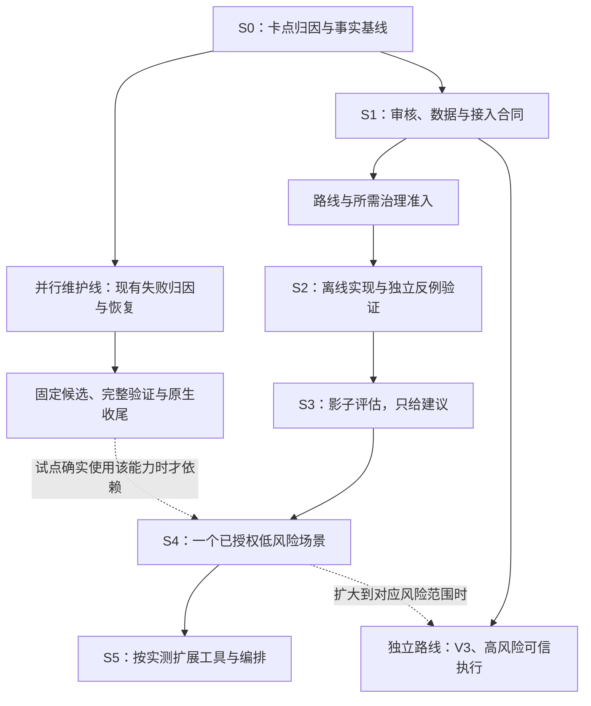

# 后续分阶段计划：多层审核、置信度反馈与减少人工介入

日期：2026-10-08。状态：后续工作排序与路线调整提案；本次交付为文档整合。

## 1. 目标、依据与适用范围

承接项目所有者本次重申的方向：机器审核层处理常规判断；通过并行独立审核、修复和复核提高质量；根据模型在特定任务上的实际完成表现持续校准置信度；用置信度调整自动放行、追加审核和人工升级策略。人类注意力集中在尚未解决的方向选择、实质分歧、权限缺口和风险接受上。

依据为[原始分流与模型路由设计](../../architecture/AI代码协同分流与模型路由设计_V0.1.md)中的条件信任度、内部历史表现、硬规则之外的评分及剩余风险。现有实现见[分流 Policy](../../../.ai/policy/routing.yaml)、[Gate](../../../src/aiflow/gate.py)、[低干预工作方式](../../operations/low-intervention.md)和[Hooks 边界](../../operations/hooks.md)。

本计划作为新的后续工作排序入口。旧 E/F/I、七项待办及原 Phase 1–4 编号保持；下文 S0–S5 仅表示本计划执行阶段，不等于原 Phase 3/4 已启动。旧[待办](../../operations/follow-up-backlog-2026-09-22.md)、[执行记录](../../operations/backlog-execution-2026-10-04.md)、[进入门](../../operations/next-stage-start-conditions-2026-10-02.md)和[合同提案](../../operations/phase-entry-proposals-2026-10-04.md)继续提供原件、现行条件和设计输入。

文档整合与已有获准范围内的只读准备可以立即推进。涉及 `src/aiflow/**`、Policy、Schema、CI、任务账本和外部副作用的实施仍按 [AGENTS.md](../../../AGENTS.md) 准入。本计划不取消现行 REVIEW 所需批准，不扩展旧 action，不改变维护模式、CI、分支保护或阶段进入门。阶段衔接以产出和验证为主，不新增逐步人工打卡。

## 2. 当前基线与问题分类

| 能力 | 已有基础 | 需要补齐 |
| --- | --- | --- |
| 低风险自主推进 | 静态 AUTO、task-free、Agent 完成机械条件 | 在范围内先用机器解决技术不确定性，减少直接升级给人的问题 |
| 审核与质量 | 双阶段审核、独立 verifier、Review–Fix–Verify、来源与失败记录 | 分开判断机器审核充分性与人类决定必要性，让审核结果影响介入强度 |
| 正式批准 | spec/code/action 分开、版本绑定、部分单次消费 | 识别仍有效授权，协调声明、动作、批准和消费，减少重复请求 |
| 模型能力反馈 | 原始概念设计、样本与 telemetry 草案 | 模型 × 任务类型 × 角色的估计、实际结果校准及不确定性表达 |
| 软件接入 | 规则、交接、报告导入和受限 wrapper | 宿主审批事件与动作的对应关系、最小 adapter、实际执行结果 |

主检出基线为 `9c956ea57c6838a404c02e2f265af4faca784110`。2026-10-08 直接读取相应工作树的 task、events 和 evidence：TASK-0063、0064、0067 为 BLOCKED；TASK-0065 为 FAILED；TASK-0068 为 IMPLEMENTING，但其完整 evidence 仍为 failed。四项 CLI status 查询曾因 Git command 错误失败，本轮未重新证明 freshness 或 Gate。原始记录不能替代成功的当前原生状态核定。

TASK-0065 在 `codex/windows-owned-job-production` / `a30a3768bf232b7314001dc774404fc7c70e8dc5` 的 `.ai/tasks/TASK-0065/events.jsonl` 已记录 Action005 批准和消费；`evidence.json` 的 2026-10-08T00:13:03Z 结论为 failed，12/14 检查通过，regression 与 integration 分别超时 900031 ms 和 600016 ms。旧文档中的“Action005 待批准”属于此前窗口，不作为当前执行指令。

TASK-0067 在 `codex/native-git-public-execution` / `3ca041878a641528b2eef16a3bcda70a409b32fe` 的原始事件还记录已有具体 action grant 与冻结 DU 声明不匹配、消费前拒绝及后续阻断。这是授权与声明协调问题，其实际验证问题须分别处理。

卡点先分四类：真实技术/环境失败；机器可以补齐的机械条件；授权、声明或状态绑定摩擦；真正需要人的方向/权限/风险决定。没有宿主决策和动作事件时不归因某个审批层。摘要滞后时追加更正并指向原件，不重写历史失败或批准。

## 3. 总体顺序和依赖图

主线为 `S0 归因与基线 → S1 合同与路线 → S2 离线实现 → S3 影子评估 → S4 有限自动处理 → S5 按证据扩展`。阶段内部按独立职责并行，共同接口、治理准入、正式验证和真实动作按依赖串行。

S1 拆分路线被正式采用前，S2/S3 的评分实施仍须满足原 Phase 3 条件。合同准备无需等全部 F、I1、E5 或跨主机调度完成；所选场景用到其中某项能力时，只接入实际依赖。

以下 sub-agent 数量均不含主 agent，是职责独立且容量允许时的计划数量。人员数量不是可信度票数；外部 worker 不标为原生 sub-agent。沿用运行时模型/推理选择，身份依实际元数据，无法核实则 unknown。

## 4. S0：卡点归因与可复核基线

目标：固定一条真实、反复发生的低风险审批卡点，把真实技术失败与审批摩擦分开。

并行准备计划启用 **4 名 sub-agent**，各独占一份调查材料：

| 职责 | 产出 | 输入及依赖 |
| --- | --- | --- |
| 仓库状态核对 | task/Policy/批准/声明与实际 Missing 的对应表 | 可工作的当前原生读取；失败时保留原件与未核定项 |
| 宿主卡点核对 | 一个场景的请求、审批、执行和结果链 | 已获准可访问的事件，不扩大私密采集 |
| 技术失败归因 | 失败分类、原预算和修复候选 | TASK-0064/65/67/68 等实际 evidence，分清 scope |
| 效果基线设计 | 请求组、任务类型、质量、返工和观察窗口定义 | 复用效果观察，批准条数不换算人的打断次数 |

主 agent 串行选择场景、整合归因和残余问题。涉及 UI 时只有主 agent 控制同一会话，不并发操作软件。

退出：动作、目标、授权与来源明确；每个停顿有证据支持的原因或 unknown；机器步骤与人类决定分开；比较窗口和质量口径明确。宿主事件暂缺时，S1 通用合同准备继续，adapter 场景验收保持未完成。

## 5. S1：多层审核、置信度与最小接入合同

### 5.1 并行设计

启用 **4 名 sub-agent**，分别独占设计材料；主 agent 独占统一计划、共享术语和接口汇总：

1. **审核与升级**：机器检查 → 专项独审 → 修复 → 残余问题复核；定义技术分歧、方向选择、权限缺口、风险接受、不可验证及每轮预算/停止条件。不用无限审核或重复票数累加可靠度。
2. **能力与概率**：模型 × 任务类型 × 角色 × 工具/上下文条件；分开估计作者成功与审核检错能力，提出先验、更新、样本不足和漂移处理方法。
3. **数据与效果**：复用既有样本/telemetry 草案，定义独立样本、尝试链、结果标签、身份、隐私、保留、缺失与偏差；明确请求组、质量、返工、缺陷和时间来源。
4. **adapter 与授权**：选择一类动作，明确能观察、建议、拦截、执行什么；分开仓库 AI Flow、Codex 宿主、应用/OS、provider、高风险执行的权限。

### 5.2 串行定稿与独立复核

各稿完成后，主 agent 统一语义和范围；再启用 **2 名非作者 sub-agent** 并行审目标符合性/低干预效果，以及权限/兼容性/证据强度。共同修复、接口冻结和治理准入依次串行；无新实质问题不重复扩大审核。

置信度拟预测指定条件下任务达到验收的可能性，附来源、样本覆盖和不确定性。审批概率须在实施前冻结语义：自动通过/人工升审的策略概率，或风险阈值判断附带的通过把握。概率抽检可以另作候选评估，不能直接用模型自报分数随机放行动作。成功概率、审核策略概率与人类权限分别表达。

拟决策顺序：核授权与硬风险边界 → 判断技术证据/剩余风险 → 证据不足先专项审核或修复 → 充分时按已核定策略处理 → 预算耗尽或真实决定缺口时只提交残余问题。治理变更完成前继续执行现行 REVIEW 双批准。

数据优先用已获准事实，固定受审版本/任务阶段及相关尝试，保留失败、取消、未运行、skip、UNKNOWN。任务未通过与模型能力失败分开；工具故障不自动归因作者模型。最终经多轮修复的通过不记为首次作者成功，Finding 数/APPROVE 数不等于审核正确率。测试通过、resolved、产品 completed 或 Gate PASS 不直接等同真实交付成功。

### 5.3 低风险与高风险路线解耦提案

提出 **3-A 低风险能力反馈与影子评估**、**3-B V3 高风险验证、损失与恢复** 两个独立能力包。3-A 不替代 3-B 的真实故障/沙箱/回滚证据，高分不创造执行权限。

现行 Phase 3 仍要求样本、真实 V3 用例边界、版本化度量三门齐备。本阶段提交拆分影响评估与最小范围方案，由实际治理准入形成具体决定。评分实施仅在原进入门齐备，或新拆分路线已正式采用并完成相应准入后开展；未决定时继续合同/只读准备，不实现生产评分或路由。

退出：数据/概率/授权语义、兼容路径与范围可评审；样本充分性、接受标准、预算、隐私和保留期有具体方案，不填造数值；真实方向/风险决定集中呈现，研究步骤和每轮复核不新增签字。

## 6. S2：离线实现与独立反例验证

依赖 S1 对应合同及路线准入。先实现无真实 provider、无外部执行副作用的最小链路；source/Policy/Schema 进入治理任务，安全文档/测试与治理面按仓库规则分开。

实现计划启用 **4 名 sub-agent**：机器审核/升级模块；证据读取/能力估计/反馈模块；单工具 adapter 离线映射模块；独立场景/反例测试。各自独占文件，具体清单在规格冻结。共同 Schema、公共 API、路由 Policy 由主 agent 串行编辑；共享接口变更先整合再分发。

输出处理建议、原因、证据与残余问题，能力估计及适用范围/不确定性，授权来源与未覆盖动作。影子分数不成为执行权限。

反例至少覆盖：已授权常规任务可自主处理；机械缺项可补；缺方向/权限准确升级；相同有效请求不重复问；过期、撤回、已消费、参数/目标/版本漂移、未知动作不误放；身份/样本不足不冒充校准；原失败不被成功覆盖。离线 fixture 标 synthetic，不写入真实验收。

模块完成后主 agent 串行整合并固定候选；启用 **2 名非作者 sub-agent** 并行审实现正确性与权限/反例边界。修复、必要复测、全部规定检查和正式 Review/Gate 按依赖串行。离线 PASS 仅证明合同与测试场景，不证明真实审批已接管或人力下降。

退出：最小链路可解释、反例成立、对应质量门全通过；真实客户端能力缺失仍列未验收。

## 7. S3：影子评估与实际结果校准

依赖 S2 通过及数据来源/隐私/窗口准入。在自然真实工作中只给建议，执行继续按现行批准/规则；不创建工作凑样本，不要求人逐项填表，不新增后台或私密采集。

启用 **4 名 sub-agent** 并行分析固定快照：预测与校准；误放/漏检和交付质量；请求组与授权覆盖；adapter 事件和来源。独立材料分开保管，主 agent 串行固定输入、汇总结果与下一轮方案。

先报告分层覆盖、缺失、不确定性、相关重复和漂移；充分后按冻结方法评估概率校准。估计、校准、留出任务/窗口分开，同任务重试不能膨胀样本或跨集合泄漏；后续修复结果不能进入此前预测。历史回放的一致性不证明取消人工之后质量相同，预测减少的请求数不称实际减少的打断。

退出：冻结口径支持目标场景的估计和审核策略；质量、误放、漏检、返工、人工介入可比较。阈值/窗口在运行前确定，样本不足继续影子或建议模式，不事后挑有利阈值。

## 8. S4：一个已授权低风险场景的有限自动处理

依赖 S3 支持该场景，授权覆盖、宿主接入点、停止/恢复办法已核实。只纳入明确、低影响、可恢复、可验证动作；push/merge/deploy/delete、凭据导出、付费调用不继承该试点权限。

准备启用 **3 名 sub-agent**：真实 adapter/宿主兼容；普通/升级/异常独立验收；效果比较/停用恢复方案。主 agent 统一范围/参数。实际操作由主 agent **串行**执行，同时启用 **2 名只读 sub-agent** 核证据和效果，不多人操作同一 UI、账本、ref 或所有权资源。

在授权内处理常规判断，追加机器审核化解不确定性；缺真实决定才集中交人。只有宿主正式支持的接入点才可减少其弹窗；缺该能力则保持建议模式，不能改审批配置或另走工具路径绕过拒绝。

退出：同类场景/可比窗口内的真实请求与等待变化有证据，质量门保持，误放/漏检/返工/缺陷符合冻结标准，停用恢复可执行。无可比数据只报告原值，不宣称减少百分比；质量未证明则停止扩大范围。

## 9. S5：按效果扩展工具、执行与编排

依赖 S4 真实退出，先复用有效场景，再按需求选下一工具/任务类，不一次推广所有软件/仓库。

候选准备启用 **5 名 sub-agent**：第二工具 adapter；E5 引擎目标兼容；provider 数据/身份/费用合同；高风险固定动作可信执行合同；协调成本/Phase 4 需求。独立产出，无需求流保持待决，实际并发数据独立流与容量减少。

可信执行可独立于 provider 设计，须有可信身份、当前授权、精确目标/参数/版本、原子消费、撤回/过期、结果/恢复。现有 wrapper 只拒绝，不直接改称执行器。provider 与高风险动作各走所需授权，均非低风险建议模式前置。

日常原生 sub-agent 并行审核现在可以用；持久队列、锁/租约、资源调度、跨主机编排、集中审批服务属于后继能力，仍满足原 Phase 4 条件后独立实施。新增目标的合同冻结、准入、候选、动作、完整验证和发布各按依赖串行。

退出：新增目标各有真实验收，反馈能调整审核强度且保留暂停/退回人工机制；扩展优先级来自实际介入和质量数据。

## 10. 现有七项待办承接表

| 旧项 | 新归属 | 必须串行的链 | 可并行、无需等待它的工作 |
| --- | --- | --- | --- |
| 1 Windows 生产化 | TASK-0065 等维护线 | 归因 → scope/候选 → 新实际动作 → 完整验证 → 收尾 | S0–S1 合同、轻量审核与置信度准备 |
| 2 TASK-0064 / 完整预算 | 依赖/timeout/验证维护线 | 依赖归因 → 恢复准入 → 修复 → 固定候选完整 V2 | 同上；试点确实依赖才加入关键路径 |
| 3 F / TASK-0063 | 独立真实来源/导入验收线 | 新准入 → 匹配原件 → preflight → record → 原生收尾 | E5/I5 设计、最小 adapter 合同 |
| 4 双通道 / 实际应用 | 各目标验收线 | 候选 → 完整等价检查/准确 CI → Apply/部署授权 | 本地产品设计、其他目标准备 |
| 5 I1 / I2 | 生命周期/扩仓分开 | 各自需求 → 准入 → 动作 → 业务验证/恢复 | 新主线；offline 不自动等于故障/恢复需求 |
| 6 E5 / I5 / Phase 3/4 | 拆入 S1–S5，低风险反馈优先具体化 | 对应合同/路线 → 准入 → 实施/影子 → 退出 | E5 三线、数据/概率、V3 准备和协调需求独立 |
| 7 远端发布 | 各已验证阶段独立出口 | 干净累计候选 → 审核/required CI → push/merge 授权 → 远端证明 | 后续本地准备，不等发布才研究 |

旧 E4、MERGED、FAILED、SPENT 和原件保持。旧 PR/CI、其他任务批准和配置候选不覆盖新版本。无实质变化不重做旧审核；实际依赖未解决则该执行路径保持未完成。

## 11. 统一并发与交付规则

- 研究/设计按问题并行，实现按独占文件并行，非作者审核可并行；修复后只复核受影响问题和必要集成行为。主 agent 委派后继续独立工作，不抢写子任务文件。
- 共享 Schema/Policy/API、统一文档、账本、Git refs 与提交由一个协调者串行写。委派写明目标、输入、产出、范围和验收；每阶段 diff/暂存复核后小步提交。
- 冻结候选进入正式完整验证时停止改源码/refs。共享主机的完整回归、coverage、integration、mutation、owned-process 生命周期按资源/所有权串行；隔离可并行须先证明，不改变原检查或预算。
- 保持完整测试、85% 总覆盖率、90% diff coverage、whitespace、Ruff、format、mypy、required CI 与分支保护。置信度、局部 PASS、影子效果或覆盖率不覆盖必需检查失败。
- 按类型核有效批准：spec 不因 subject 变化当然重签，action 不因技术信心复活。先核实际 status/gate；读取失败先诊断，不默认失效或要求重签。真实外部发布仍需具体授权。

## 12. 效果验收与下一批具体工作

最终同时验收：目标质量保持；真实人工介入下降；概率与实际结果相符。最低记录是版本/场景/窗口、独立任务/尝试链、结果证据、请求组/原因、误放/漏检、返工/缺陷、来源/缺失。人工分钟只用可核实来源，未知保持 unknown；观察缺项本身不成为交付门禁。

1. **现在并行准备，4 名 sub-agent**：S0 授权/声明、宿主卡点、技术失败、效果基线；主 agent 同步 S1 共享术语与旧项映射。缺宿主材料不阻塞其他流。
2. **材料足够后串行定稿**：固定首场景，整合 S1 四类合同，具体化拆分路线与概率语义，形成最小可评审治理范围。可同时决定的真实问题一起呈现，不逐项请人批准研究步骤。
3. **独审后进入实施**：两路非作者复核 → 修复 → 核实际 Missing → 只补缺失决定 → 对应准入完成后 S2。未完成则继续无依赖的准备和已获准维护。

本次完成方向/旧计划整合、排序与入口链接。S0 真实宿主卡点未复现，S1 合同未冻结，S2–S5 未实施。本文未创建治理 task、生产分数或概率，未调用 provider、启动 V3/服务/调度，未远端发布。

## 13. S1 合同准备入口（2026-10-08 追加）

[统一合同提案](../specs/2026-10-08-review-confidence-contract-proposal.md)给出审核升级、能力/概率、样本/效果和最小 advisory adapter 四类合同，以及 3-A/3-B 的影响与集中待定参数。四份材料由独占职责的 sub-agent 并行准备，主 agent 串行整合，非作者独审；文档交付不作为路线正式采纳、样本充分或 S2–S5 实施。

另一路发布 A 整合任务已实际创建为 TASK-0069，阶段提交 `c9e0132933f894ed5c684af08952fd535e863fc5`；独立 Design APPROVE、0 findings，当前原生核定仅缺 `spec_approval`。这是新的规格决定点，不复用旧任务批准；具体原件与绑定见统一提案第 2、8 节。本节不修改上述历史读取窗口，也不解除既有失败、阶段门或具体动作权限。

## 14. 非评分设计与整合实施（2026-10-08 追加）

[执行记录](../../operations/next-plan-execution-2026-10-08.md)区分当前机器步骤、已存在决定与原件未知。TASK-0069 规格已实际获批并原生 begin；非评分[状态解释设计](../specs/2026-10-08-advisory-status-explanation-design.md)已完成两路独审和定点修复。设计只解释固定已有记录，不产分数或执行建议；CreateNew 真宿主场景后移 S4。原 S1 提案、3-A/3-B 正式采纳、原 Phase3 门及新源码治理准入仍分别处理，不以本次普通文档或 Task69 批准代替。

## 15. 全目标核对与S1兼容/审核预算（2026-10-09追加）

[S1补充](../specs/2026-10-09-s1-contract-compatibility-and-review-budget.md)给出提案、非评分设计和实际冻结C71 API的版本适用映射、预算来源/职责/停止残余格式，以及三个synthetic正交例子；不填造数值、不增加每轮签字或产品字段，不代替3-A/3-B采纳。两非作者定点复核后0未解决项，Root只修Git EOF空行并保留已审原件。普通文档准备不证明真实数据、校准、自动处理或阶段退出。

[全范围完成核对](../../operations/follow-up-completion-audit-2026-10-09.md)逐项承接原七项与S0–S5。S2已有实际非评分实现和一次完整V2尝试，但必需检查失败/F累计未运行，不能沿用旧窗口的“未实施”来描述当前，也不能称完整S2或评分链完成。其他阶段继续依赖真实需求、数据/身份/真值、适用准入与效果证据。F历史恢复与新真实导入范围分别核依赖，未选目标及有限未定位原件保持unknown。

本轮3名sub-agent并行核1–3、4–7、S0–S5，1名S1作者后交2名非作者并行审；Root串行汇合入口和提交。新诊断精确动作仍待批准，后续真实绑定/资源与actor/final审查/一次观察/根因/新源码规格及完整验证须串行；各业务线和远端发布不自动获准。当前任务状态、封闭成员与14保护输入窗口见[执行记录](../../operations/next-plan-execution-2026-10-08.md)。原计划正文和历史状态保留，整体目标未完成。
