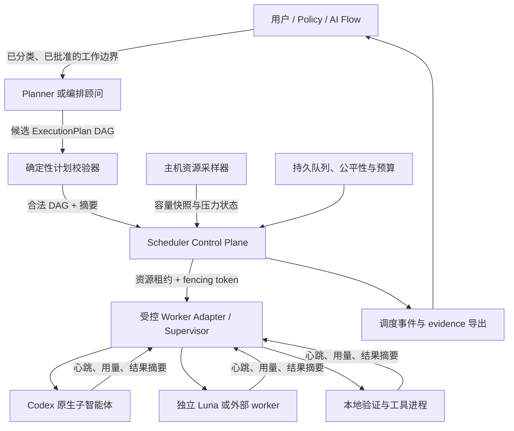
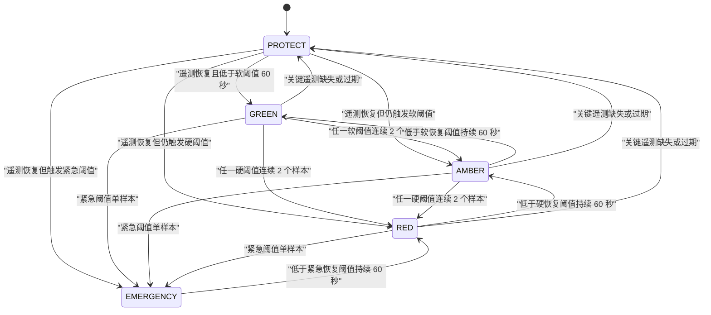

# 资源感知的多智能体调度与本机过载防护设计

> 日期：2026-08-13
> 状态：设计范围已获用户授权；运行时实现尚未获准、尚未开始
> 适用阶段：阶段二采集、阶段三建模、阶段四单机编排
> 阶段一关系：补充未来路线，不修改阶段一 MVP 规格或实施目录的哈希基线

## 1. 问题与目标

用户已观察到：同一电脑上同时运行过多主智能体、子智能体和工具进程时，负载会快速累积，严重时可导致桌面无响应或死机。现有项目只在单个 Codex 会话设置了静态子智能体并发上限，长期路线也只笼统列出“并行、任务队列、预算和独立编排器”，尚未定义整机容量、嵌套子智能体、多个会话、外部 worker、工具子进程和故障恢复之间的统一约束。

本设计的目标是：

1. 先保护本机和主会话的可用性，再优化任务吞吐量；
2. 在整棵任务树、整个仓库和整台主机范围内统一计算并发与资源预算；
3. 只对真正独立、无写入冲突、可审计且资源画像可信的节点启用并行；
4. 在过载、遥测缺失、调度器重启或 worker 失联时保守失败并可恢复；
5. 保持 AI Flow 对分流、验证、批准、范围和 Gate 的唯一治理权；
6. 为后续模型、角色、费用和关键路径优化提供可复放的数据，而不让概率性模型直接控制安全边界。

本设计把用户口中的“指挥官”正式定义为**编排顾问**。它可以理解任务和提出调度方案，但不能直接授予资源、绕过审批或扩大并发。真正的运行时裁决者是**确定性调度控制面**。

## 2. 事实基线与能力边界

### 2.1 当前项目事实

- 阶段一明确不实现真实模型 API、供应商无关的多模型编排或跨机器并发状态同步。
- 阶段一 MVP 规格和实施目录已由当前人工状态文件绑定 SHA-256，本设计不改写这两个文件。
- 当前 `aiflow` 仅有 help/version 工程骨架，任务状态、Policy、批准和 Gate 尚未成为可执行能力。
- `.codex/config.toml` 当前将每个会话的并发子智能体上限设为 2。该值排除主线程，而且不能覆盖其他会话、独立 worker 或普通工具进程，因此只能视为外层静态缓解措施。
- `.codex/config.toml` 当前主模型推理档位为 `max`，而 2026-08-05 的模型路由决定记录为 `high`。这是既有配置—决定漂移，必须在任何调度器实现前通过单独 REVIEW 处理；本次不顺手修改。
- `docs/superpowers/plans/2026-08-08-external-worker-routing-implementation.md` 是尚待其自身审批门的候选实施输入，不是已完成或已授权的运行时能力。

### 2.2 当前 Codex 与 Multi-agent 事实

官方文档说明：

- 并行子智能体适合可拆为独立、边界清楚的工作，不适合顺序依赖强或争用同一可变资源的工作；每个子智能体都会增加模型和工具消耗。
- Responses API 的 `max_concurrent_subagents` 控制一棵请求树中同时活跃的全部后代，但不等同于一台电脑跨会话、跨进程的全局容量控制。
- 本地 Codex 的 `agents.max_concurrent_threads_per_session` 是每会话上限；子智能体继承父会话权限，并行写入需格外谨慎。

依据：

- [OpenAI Multi-agent guide](https://developers.openai.com/api/docs/guides/responses-multi-agent)
- [Codex Subagents guide](https://learn.chatgpt.com/docs/agent-configuration/subagents)

因此，本项目不能把平台级“最多 N 个子智能体”误称为整机资源安全保证。只有当所有 worker 启动都可被统一 adapter 截获、计量和拒绝时，调度器才能宣称具有强制力；否则必须标记为 `advisory`，并回退到单 worker、禁止嵌套的保守模式。

## 3. 方案比较与决定

### 3.1 方案 A：只设置固定并发上限

做法：继续使用每会话 `max_concurrent_threads_per_session`，必要时把数字调低。

优点：立即可用、实现成本低、容易解释。

缺点：不知道 worker 的实际内存、CPU 和 I/O；不能统筹多个会话、嵌套子智能体、外部 worker 和测试进程；轻任务与重任务占用同一计数；无法处理恢复、优先级、公平性或资源突增。

结论：保留为纵深防御，但不能作为最终方案。

### 3.2 方案 B：让 LLM “指挥官”直接调度

做法：由一个高性能模型拆分任务、决定并发数并直接启动、暂停或终止 worker。

优点：能理解任务语义，早期原型灵活，关键路径建议可能优于固定规则。

缺点：资源读数、优先级和故障决策难以确定性复放；模型可能高估独立性、低估负载、递归生成更多子智能体，或把“更快完成”错误地置于安全和治理门之上。

结论：拒绝作为控制面。LLM 只能给出候选计划。

### 3.3 方案 C：编排顾问 + 确定性控制面

做法：LLM 编排顾问生成候选 DAG、资源画像和并行建议；确定性控制面校验计划、执行准入、发放租约、维护队列、实施背压并记录证据。

优点：保留语义规划能力，同时让安全边界、调度顺序和恢复逻辑可测试、可复放、可审计；可以先交付不含 LLM 的控制面，再逐步接入顾问。

缺点：需要明确契约、持久状态和 adapter 能力协商，实施量高于固定上限。

**决定：采用方案 C。当前先冻结两份非执行预进入蓝图；未来第一份正式计划只建设确定性本机防护，且只有它通过后，才可另建编排顾问与真实 adapter 的第二份正式计划。**

## 4. 权责分层



### 4.1 AI Flow 治理面

AI Flow 独占以下权力：

- 拆解决策单元并决定 `AUTO / ASK / REVIEW / BLOCK`；
- 决定验证等级、规格冻结、批准、失效和 Gate；
- 定义允许路径、禁止动作、权限和 `subject_commit`；
- 在范围、风险、依赖、Policy 或权限变化时升级或重新分类。

调度器不得改变、推断放宽或替代这些结论。资源不足只能导致排队、降载、暂停、取消安全候选或升级，不能通过降低分流或验证等级来释放容量。

### 4.2 编排顾问（Commander）

编排顾问可以：

- 把已授权工作提议为 DAG；
- 标注依赖、候选角色、读写范围和关键路径；
- 提议资源等级、是否值得并行和可接受的降级方案；
- 把队列等待、拒绝和资源风险解释给用户。

编排顾问不得：

- 直接调用 spawn 绕过 dispatcher；
- 提高自己的优先级或增加预算；
- 批准自己的计划、解除 BLOCK 或降低验证等级；
- 修改资源采样、租约、fencing token 或恢复状态；
- 把未知 adapter 能力解释为“支持暂停/终止”。

顾问输出始终标记为 `untrusted_proposal`，只有经确定性 Schema、治理摘要和资源约束校验后才能进入队列。

### 4.3 确定性调度控制面

控制面是唯一可以：

- 把合法节点从队列变为 `ADMITTED`；
- 发放、续租和回收资源租约；
- 对整棵任务树、主机、仓库、会话和 adapter 施加配额；
- 实施公平队列、工作区互斥、背压和恢复节流；
- 接受有效完成结果并拒绝迟到或过期结果。

相同 Policy、计划、队列状态、资源快照和时钟输入必须产生相同决定及理由码。

### 4.4 Worker Adapter 与 Supervisor

每种 worker 类型必须通过 adapter 暴露能力矩阵：

| 能力 | 含义 |
|---|---|
| `can_enforce_spawn` | 所有启动是否必经控制面 |
| `can_observe_lifecycle` | 是否可可靠观察启动、心跳和退出 |
| `can_measure_resources` | 是否能把本机资源消耗归因到 worker |
| `can_interrupt` | 是否支持协作式中断 |
| `can_resume` | 是否能恢复同一上下文 |
| `can_checkpoint` | 是否可生成一致检查点 |
| `can_kill_isolated` | 是否可安全终止已隔离且无未提交副作用的进程 |

只有运行时证据同时证明 `can_enforce_spawn=true` 和 `can_observe_lifecycle=true` 的 adapter 才可进入 `enforced` 模式。无法截获直接 spawn 或无法观察完整生命周期时，adapter 必须进入 `advisory_unenforceable`：调度器只能保证**自己**不再启动第二个该类受管 worker，不能保证其他会话或进程遵守全局上限。操作层必须禁用嵌套/自动 spawn，所有相关 evidence 明确记录能力缺口；该模式不能满足“全树强制计数”的发布验收。

## 5. 核心数据契约

所有结构使用带版本号的 JSON/YAML Schema，稳定序列化后计算 SHA-256。时间同时保存 UTC wall clock 和单调时钟序号；排序和租约超时使用单调时钟，审计展示使用 UTC。

### 5.1 `ExecutionPlan`

一个候选计划至少包含：

```yaml
schema: execution-plan.v1
plan_id: PLAN-0001
root_task_id: TASK-0001
repository_id: sha256:0000000000000000000000000000000000000000000000000000000000000001
spec_sha256: sha256:0000000000000000000000000000000000000000000000000000000000000002
policy_sha256: sha256:0000000000000000000000000000000000000000000000000000000000000003
subject_commit: 0123456789abcdef0123456789abcdef01234567
created_by: planner-id
nodes:
  - node_id: NODE-0001
    parent_node_id: null
    depends_on: []
    role: explorer
    adapter: codex-native
    operation_class: read_only
    allowed_paths: [src/]
    conflict_keys: []
    resource_profile_id: PROFILE-READ-M
    retry_policy: idempotent
    checkpoint_policy: none
    budget:
      wall_time_seconds: 900
      model_tokens_max: 120000
      external_cost_minor_units_max: 0
```

计划校验器必须拒绝：环、重复节点、未知父节点、未声明资源画像、空或越界范围、写节点缺少冲突键、无治理摘要、预算为负、未知 adapter、把独立 Luna 声称为原生子智能体，以及任何从子节点放宽父节点权限或预算的计划。

### 5.2 `ResourceProfile`

资源画像使用向量而非单一权重：

- `cpu_units`：1000 表示一个逻辑核心的持续占用；
- `memory_bytes_reserved` 与 `memory_bytes_burst`；
- `io_weight`：0–100 的相对磁盘压力；
- `process_slots`、`native_agent_slots`、`external_worker_slots`；
- `estimated_wall_time_seconds`；
- 模型 Token、工具调用和外部费用上限；
- `confidence`：`measured / provisional / conservative / unknown`；
- `source_window`：画像依据的样本窗口和版本。

未校准或不可观测的 worker 使用 `unknown`。其默认处理不是猜测一个乐观数字，而是独占调度器可控制的同类 slot、禁止嵌套，并按单 worker 模式运行；如果 adapter 本身不可强制，则进一步标记 `advisory_unenforceable`。

### 5.3 `HostCapacitySnapshot`

采样器至少记录：

- 总内存、可用内存、commit/pagefile 压力；
- 系统 CPU 与受控进程树 CPU 的短窗和长窗平均值；
- 磁盘繁忙度、I/O 队列或平台可得的等价指标；
- 受控进程数、活跃租约、队列长度；
- 遥测来源、采样时间、新鲜度和缺失字段；
- 当前压力状态与触发理由码。

跨平台缺失字段不能默认为 0。关键字段缺失或快照过期会进入 `PROTECT`，行为等同 RED 的“停止新准入”，但与真实资源过载分开审计。

### 5.4 `ResourceLease`

租约至少包含：

- `lease_id`、`root_task_id`、`node_id`、`attempt`；
- worker 与 adapter 的已观察身份；
- 资源 reservation 向量；
- `issued_at`、`expires_at`、心跳期限；
- 单调递增的 `fencing_token`；
- 每个 attempt 独立生成的 256-bit callback capability 的 SHA-256 摘要和轮换序号；
- plan、spec、Policy 和 subject commit 摘要；
- 工作区和冲突锁；
- 当前状态和最后心跳。

callback capability 明文只通过受保护、绑定 adapter 的 IPC 传递，不能放入命令行、普通环境变量、数据库、日志或 evidence；持久层只保存摘要。心跳、完成、暂停和取消必须同时验证 capability、lease ID、fencing token、adapter 身份和可观察的 OS/线程身份，并使用常量时间比较。retry、重新准入和权限变化必须轮换 capability；跨 attempt 重放形成安全事件并被拒绝。

同一节点同一时刻只能有一个有效 attempt。fencing 只保护调度状态，不能阻止旧 worker 继续产生副作用。旧 attempt 的迟到回调不能覆盖新状态；对写入或外部副作用节点，在确认旧进程退出、工作区/外部状态完成一致性核对之前，不释放 reservation 和冲突锁，也不发放同范围新 attempt。无法隔离或无法确认退出的节点进入 `REVIEW_REQUIRED`，不得自动重试。

### 5.5 `SchedulingDecision`

每次准入、拒绝、暂停、恢复或取消都记录：

- 候选集合及稳定排序键；
- 有效配额和当前 reservation；
- 资源快照摘要；
- Policy、计划和能力矩阵摘要；
- 结果与机器可判定理由码；
- 人类可读解释；
- 发放或影响的租约 ID。

禁止记录凭据、授权头、完整用户提示词、模型隐藏推理或未经脱敏的完整日志。

## 6. 并行资格与准入算法

### 6.1 默认顺序执行

在资源画像未校准、adapter 不能强制启动路径或冲突分析不完整时，默认只允许运行一个子 worker。并行不是默认权利，而是满足全部条件后的优化。

节点只有同时满足以下条件才具备并行资格：

1. AI Flow 治理前置条件有效；
2. DAG 依赖全部成功且未失效；
3. 与运行中写节点没有 worktree、文件范围或外部副作用冲突；
4. adapter 能力满足该节点的取消、重试和观测要求；
5. 资源画像不是未经处理的未知值；
6. 主机压力允许新准入；
7. 主机、根任务树、仓库、会话、adapter 和预算均有剩余；
8. 节点拥有可追踪的幂等键，或明确声明不可自动重试。

### 6.2 有效并发

任何时刻的有效可用并发取以下约束的最小剩余量：

```text
runtime hard cap
host cap
root-task-tree cap
repository cap
session cap
adapter/provider cap
resource-vector capacity
time/token/cost budget
```

计数覆盖所有后代，不能因子智能体再生成子智能体而重置。父任务的子节点共享父级预算；创建更多节点不会获得更多配额。

### 6.3 队列、公平性和排序

优先级类别由 Policy、用户批准或系统恢复事件赋予，Agent 不能自行提升：

1. `safety_recovery`
2. `user_blocking`
3. `required_verification`
4. `normal`
5. `background`

同一压力和容量输入下，调度顺序为：

1. 先过滤所有不具备资格的节点并记录原因；
2. `safety_recovery` 严格优先，但仍须满足资源和治理硬上限；
3. 其余四个类别以 `8/6/4/1` 的 quantum 运行类别级 weighted deficit round robin；
4. 选中类别后，再按 root task 和 repository 运行第二层 weighted deficit round robin，防止一个父任务通过大量子节点占满类别；
5. 等待每满 300 秒增加一个一次性 aging quantum，最多补到 8；aging 不改变 Policy priority class；
6. 类别、root 和 repository 的稳定队列内按 `queued_at`、`root_task_id`、`node_id` 排序；
7. 选择第一个能完整放入当前资源向量的节点，不做资源超卖；若连续 15 分钟出现至少一个能容纳该节点的容量窗口却仍未服务，公平性测试失败。始终放不下的节点记录明确容量/预算原因，不伪称饥饿已解决。

默认类别 quantum 为 `user_blocking=8`、`required_verification=6`、`normal=4`、`background=1`。`safety_recovery` 不参与普通权重竞争。类别 quantum、第二层 root/repository 权重或 aging 变化都属于 Policy 变化，需要重新验证。

### 6.4 工作区与写入隔离

- 同一 worktree 同时最多一个写节点持有有效租约。
- 不同 worktree 只有在允许路径与外部副作用均不冲突时才可并行写入。
- 每个写 attempt 使用独立 worktree 和运行目录；lease 到期、leader 切换或 worker 失联不会自动释放写锁。只有观察到旧进程退出并完成 Git/外部状态核对后才能清理隔离区或启动同范围新 attempt。
- 只读节点仍须声明范围；读取会生成锁冲突的本地数据库、构建缓存或服务端口时不能伪装成无副作用。
- Reviewer 与 Implementer 的上下文独立性由治理层要求，调度器只负责工作区、身份和租约隔离，不能以“并行更快”为由合并角色。

## 7. 本机容量与压力状态机

### 7.1 启动保留量

本机配置必须为用户界面和主会话保留资源。未完成机器校准时使用安全启动模式：

- 子 worker 全局并发为 1；
- 禁止嵌套子智能体；
- 未知资源画像不与任何其他 worker 并行；
- 不启动推测性、后台或非必要交叉验证节点；
- 至少保留 `max(2 GiB, 20% total RAM)`，保留量不足时不启动子 worker；
- 至少保留一个逻辑核心给系统和主会话；单核心机器只允许顺序远端工作，禁止本地 CPU 密集子进程并发。

阶段三容量校准使用 10 分钟空闲基线。每类 worker 的前 10 次独立单 worker 代表性运行只能形成 `provisional`，reservation 取观测 p95 加 25% 安全余量、burst 取最大值加 10%，且不得据此提高并发。标记 `measured` 并放宽并发需要另有至少 100 个不参与校准的 held-out 独立样本，reservation 低估事件为 0；这使单侧 95% 二项置信上界低于约 3.7%。样本不足、出现低估或 workload/运行时版本漂移时保持 `conservative`。该统计门约束已观察窗口，不代表未来负载绝对安全。

### 7.2 压力状态



默认采样周期为 5 秒。阈值存入 Policy；首个实现使用以下保守默认值，之后只能根据有证据的机器配置调整：

| 状态触发 | 内存 | CPU（30 秒均值） | 磁盘繁忙度（30 秒均值） | 行为 |
|---|---|---|---|---|
| AMBER | 可用内存低于 25% 或保留量 + 1 GiB | ≥ 70% | ≥ 80% | 停止 background 和推测性准入；不扩大并发 |
| RED | 可用内存低于 15% 或系统 commit ≥ 85% | ≥ 90% | ≥ 95% | 停止全部新准入；请求可检查点 worker 暂停 |
| EMERGENCY | 可用内存低于 8%、commit ≥ 95% 或 OS 报告关键内存压力 | ≥ 98% 持续 30 秒且主会话/调度心跳延迟 ≥ 15 秒 | I/O 错误导致状态持久化不可靠，或 ≥ 99% 持续 30 秒且心跳延迟 ≥ 15 秒 | 保持拒绝；只取消明确可安全取消且隔离的 worker |
| PROTECT | 内存或时钟等关键遥测缺失、快照超过 15 秒 | — | — | 行为等同 RED，但原因单独记录 |

若多个信号冲突，取最严重状态。恢复使用 60 秒滞后窗口，并且每 30 秒最多重新放行一个 worker，防止惊群。

### 7.3 暂停、取消与终止

- `interrupt` 是协作式请求，不等于已停止；资源在确认停止前仍计入 reservation。
- 只有 adapter 声明 `can_checkpoint` 且检查点通过完整性校验时，节点才能进入 `SUSPENDED` 并释放资源。
- 不可检查点的写节点默认继续运行或进入人工升级，不能为释放资源而粗暴终止。
- 只有 `can_kill_isolated=true`、无未提交外部副作用且 Policy 明确允许的进程，才能在 EMERGENCY 自动终止。
- 调度器不得结束未知 PID、非本任务进程、主会话或操作系统进程。
- `DRAINING` 表示 adapter 已停止接受新工作、worker 正在完成安全清理但尚未确认退出；期间心跳、reservation 和冲突锁继续有效。超过 Policy 的 drain deadline 时，只有可安全终止的隔离进程可进入强制终止，其余转 `REVIEW_REQUIRED`。
- `CANCELLED` 只在观察到进程退出，或一致 checkpoint 已验证且 adapter 明确证明原执行不会继续产生副作用后成立。请求取消、失去心跳或 lease 到期都不能单独释放资源。

## 8. 调度状态与恢复

调度状态独立于 AI Flow 治理状态：

```text
PROPOSED -> VALIDATED -> QUEUED -> ADMITTED -> STARTING -> RUNNING
RUNNING -> SUCCEEDED | FAILED | SUSPEND_REQUESTED | CANCEL_REQUESTED
SUSPEND_REQUESTED -> SUSPENDED | RUNNING | FAILED_RESOURCE
CANCEL_REQUESTED -> RUNNING | DRAINING | CANCELLED | REVIEW_REQUIRED
DRAINING -> CANCELLED | REVIEW_REQUIRED | ORPHANED
SUSPENDED -> QUEUED | CANCELLED
STARTING/RUNNING/SUSPEND_REQUESTED/CANCEL_REQUESTED/DRAINING -> ORPHANED
ORPHANED -> QUEUED | REVIEW_REQUIRED | CANCELLED
```

`BLOCKED`、`WAITING_FOR_REVIEW` 等词保留给 AI Flow，不在调度状态机中复用。

### 8.1 主机级状态根与单 leader

单机控制面必须使用由操作员配置、位于仓库和任务目录之外的唯一 `scheduler_state_root`。Windows 默认解析到当前用户受限 ACL 的 LocalAppData 子目录；其他平台使用等价的用户本地状态目录。根目录包含一个主机身份文件、一个 SQLite WAL 数据库和一个 OS 独占锁文件；callback capability 明文不落盘，数据库只保存摘要。任务运行目录只保存该任务的脱敏 evidence/export，不能各自建立调度数据库。

所有希望获得“全机强制”保证的会话和仓库必须连接同一 state root。state root 不可写、身份不匹配、ACL 过宽、数据库损坏或另一个 leader 持锁时，新实例进入只读观察或 PROTECT，不得静默退化成每任务数据库。

leader 算法固定为：

1. 先取得不可被第二实例窃取的 OS 级独占进程锁；
2. 持锁后以 SQLite `BEGIN IMMEDIATE` 和 compare-and-swap 把 `leader_epoch` 单调加一；
3. 只有仍持有 OS 锁且 epoch 与数据库当前值相同的实例可 dispatch；
4. reservation、冲突锁、lease 和 admission event 必须在同一个数据库事务中创建，并写入 leader epoch；
5. 一旦锁、数据库连接或 epoch 校验失败，实例立即停止准入；旧 leader 恢复时必须重新竞争锁和新 epoch，不能继续使用旧权限。

### 8.2 事件重放与 orphan 恢复

单机首版使用 SQLite WAL 和追加事件：

- 状态变更先追加事件，再更新物化状态；
- 每个租约使用单调递增 fencing token；
- leader 重启后先进入 `RECOVERING`，停止新准入并核对所有未过期租约；
- 无可靠心跳的租约转为 `ORPHANED`；
- 只有确认旧执行已退出、拥有独立运行目录、幂等且无外部副作用的节点可自动重新排队；
- 写节点、付费调用或外部副作用不明的节点转为 `REVIEW_REQUIRED`；
- 旧 attempt 的回调不得改变当前节点状态，旧进程未确认退出前仍占用 reservation 和冲突锁；
- 每次 retry/续租轮换 callback capability，数据库和 evidence 只保存其摘要。

## 9. 审计与可观测性

每次 `validate / enqueue / admit / reject / start / heartbeat / throttle / suspend / resume / cancel / expire / recover / complete` 都生成追加式事件。事件必须包含：

- 当前规格、Policy、计划和 `subject_commit` 摘要；
- root task、节点、attempt、adapter 和观察到的 worker 身份；
- 决策前资源快照、有效预算与配额；
- 稳定理由码与可读解释；
- 租约、锁和 fencing token；
- 实际资源与预算结算；
- 任何能力缺口、人工覆盖或失败关闭。

关键指标：

- 主机、任务树、仓库和 adapter 的 active leases；
- 队列等待时间及按理由分类的拒绝数；
- 各压力状态持续时间和转换次数；
- 资源估计误差、burst 次数、暂停成功率；
- orphan、迟到回调、重复 attempt 和恢复结果；
- 模型 Token、外部费用和工具进程用量；
- 主会话响应性探针和操作员手动降载次数。

原始凭据、授权头、完整提示词和模型隐藏推理不得进入指标或 evidence。日志过滤失败时停止持久化敏感负载并记录结构化错误，不能把未过滤内容作为“调试证据”写入仓库。

## 10. 安全与治理不变量

1. 并发按整棵 root task tree 计数，不按单个父节点或会话重置。
2. 任何运行节点必须持有唯一、有效且可审计的资源租约。
3. 无租约、callback capability 验证失败、租约过期或 fencing token 落后时，结果不能改变当前状态。
4. 调度器不得降低 route、验证等级、批准要求或 Gate 结论。
5. 子节点的范围、权限、预算和并发上限不得高于祖先。
6. 资源不足只能排队、降载、暂停、取消安全候选或升级。
7. 关键遥测缺失、配置漂移、Policy 摘要不符或 adapter 能力不明时停止新准入。
8. 只有能力证据证明可截获的 adapter 才能强制所有 spawn 经 dispatcher；无法强制时标记 `advisory_unenforceable`，调度器只保证不再启动第二个受管 worker，操作层禁止嵌套且不得声称全局上限。
9. 同一 worktree 同时最多一个写租约；每个写 attempt 使用隔离 worktree/运行目录，旧进程未确认退出和核对前不释放冲突锁；跨 worktree 仍需检查文件和外部副作用冲突。
10. 一个逻辑节点同时最多一个有效 attempt。
11. 非幂等或存在外部副作用的节点不得自动重试。
12. 高优先级不能穿透主机资源、费用或治理硬上限。
13. 任何自动终止只能作用于明确隔离且可安全取消的受控 worker。
14. 调度器重启时默认停止准入，先恢复日志、租约和锁。
15. 独立 Luna 始终记录为 `native_subagent=false`，不得伪装为 Sol 的原生子智能体。
16. 外部 worker 的顺序 fallback、身份验证和 Sol 最终复核约束不因本调度器而放宽。
17. 资源阈值、队列权重、adapter 能力或恢复策略变化属于 Policy/规格变化，必须重新验证。
18. 每项调度决定都能由已记录输入确定性复放；不能复放的模型建议不得成为安全依据。
19. 所有受控会话和仓库共享唯一、受限权限的主机状态根；不可用时进入 PROTECT，不能退化为任务级数据库。
20. callback capability 明文不得进入数据库、命令行、普通环境、日志或 evidence；每次 retry/重新准入必须轮换。

## 11. 故障与威胁模型

| 场景 | 默认处理 |
|---|---|
| LLM 低估资源或错误声称可并行 | 校验器使用保守画像和冲突分析；顾问建议无直接效力 |
| 子智能体递归生成更多后代 | dispatcher 继承 root 配额；不可截获时禁止嵌套 |
| 多个 Codex 会话各自未超限但整机超载 | 主机级 leader 和租约统一计数；未接入会话视为不可控负载并减少可用容量 |
| 内存快速突增 | burst reservation、5 秒采样、EMERGENCY 单样本触发；停止准入并只取消安全候选 |
| 遥测停更或返回零值 | 进入 PROTECT，不把缺失值当空闲容量 |
| 调度器崩溃 | WAL 恢复、停止准入、租约核对、orphan 分流 |
| 旧 leader 暂停后恢复形成 split brain | OS 独占锁 + SQLite epoch/CAS；锁或 epoch 不匹配立即停止 dispatch |
| worker 失联后迟到完成 | capability、身份和 fencing 拒绝旧结果；旧进程未确认退出前不释放副作用锁 |
| worker 伪造或重放 callback | 每 attempt 高熵 capability、摘要持久化、常量时间验证和轮换；跨 attempt 重放拒绝 |
| 重试造成重复外部动作 | 非幂等节点进入 REVIEW_REQUIRED，不自动重试 |
| 高优先级任务淹没后台任务 | DRR + aging；但资源/预算不满足时给出明确拒绝原因 |
| Agent 自提优先级或预算 | Schema 只接受 Policy/用户签名来源，其他值拒绝 |
| 同一文件被两个 worker 修改 | worktree 写锁、冲突键和允许路径检查阻止同时准入 |
| 恶意/错误 worker 伪造心跳 | 同时验证 callback capability、adapter/OS 身份、lease 和 fencing；原始 capability 不入库 |
| 操作员为了速度绕过 scheduler | 受控 adapter 拒绝无租约启动；Gate 检查调度 evidence；若运行时不能观察或拦截 direct spawn，则标记 `advisory_unenforceable`，不能宣称已完全阻断逃逸 |

## 12. 分阶段交付

### S0：设计与保守运行说明（本次）

- 冻结本设计与两个非执行的预进入设计蓝图；
- 保留当前每会话静态上限作为纵深防御，但不宣称它是全局保护；
- 登记配置—决定漂移和 Task 1.1 既有 `needs_revalidation`，不借本次变更关闭任何阻断；
- 不启动 worker、不修改运行配置、不实现调度代码。

### S1：阶段二的遥测与契约

- 在阶段一通过后定义资源、DAG、租约、事件和 adapter 能力 Schema；
- 用假时钟、假资源采样器和 mock supervisor 建立完全离线的确定性仿真；
- 收集单 worker 代表性资源画像，不做自动调度。

### S2：阶段三的容量画像与策略评估

- 建立角色 × 模型 × 工具环境 × 资源画像的版本化注册表；
- 用历史数据校准 reservation、安全余量、压力阈值和队列权重；
- 影子运行调度器，只记录“本会如何决定”，不实际启动 worker。

### S3：阶段四的单机确定性控制面

- 实现持久队列、主机级租约、工作区锁、压力状态和恢复；
- 先接入 mock 和受控本地子进程，再接入能够强制拦截的 worker adapter；
- 未能截获的 worker 继续单 worker、禁止嵌套。

### S4：阶段四的编排顾问与自适应优化

- 接入只产出候选 DAG 的编排顾问；
- 根据有证据的画像改进资源估计、关键路径和预算分配；
- 自适应变化先以建议形式进入 REVIEW，不能在运行中自行改写硬 Policy。

### S5：以后单独规划的多机编排

多机器 leader election、分布式租约、一致性和跨主机故障恢复不在本设计及两份预进入蓝图内。只有单机控制面通过真实试点、阶段四接口稳定且出现明确跨机器需求后，才建立单独规格与计划。

## 13. 验收标准

### 13.1 安全正确性

1. 对 `enforced` adapter，三层嵌套 DAG 在任何输入下都不会超过 host、root、repository、session 和 adapter 的最小上限；`advisory_unenforceable` 明确不计为此项通过。
2. 任何受控 worker start 事件都有唯一有效租约和 callback capability；测试中注入无租约、伪造 capability、错误身份或旧 token 的结果必须被拒绝。
3. RED、EMERGENCY 或 PROTECT 下不产生新 start；状态转换和资源快照有完整原因码。
4. 调度器崩溃、重复回调、心跳超时和租约过期后，不出现两个有效 admission；旧 worker 未确认退出前不释放冲突锁或启动同范围新 attempt。
5. 同 worktree 写节点从不并发；无冲突且资源足够的只读节点可以并行。
6. 资源恢复后每 30 秒最多新增一个 worker，不发生惊群。
7. 未知 adapter、未知资源画像、配置漂移和关键遥测缺失都保守失败。
8. 自动化测试不通过真实压满本机验证；任何真实压力试点需单独动作批准、可回滚环境和人工监看。
9. 两个仓库、两个会话连接同一主机状态根时，OS 锁和 leader epoch 阻止 split brain；状态根不可用时两者都不能建立任务级替代数据库。

### 13.2 确定性与审计

1. 相同 Policy、DAG、快照、队列和假时钟输入生成字节稳定的决定摘要。
2. 每个调度状态转换都可由事件日志复放为相同物化状态。
3. 100% 的 dispatch、拒绝、暂停、恢复、取消、orphan 和完成决定包含摘要、理由码和租约引用。
4. evidence 不含凭据、完整提示词、隐藏推理或未脱敏日志。
5. 规格、Policy、能力矩阵或 subject commit 变化会使旧调度批准和 evidence 失效。

### 13.3 公平性与性能

1. 离线仿真逐项断言：`safety_recovery` 严格优先；其余类别按 `8/6/4/1` weighted DRR；类内 root/repository DRR；aging quantum；在 15 分钟内出现可容纳窗口的合法后台节点获得服务，否则输出明确容量/预算拒绝。
2. 固定 benchmark 使用 Windows 11 x64、CPython 3.11、至少 8 个逻辑核心、16 GiB RAM 和本地 SSD，运行时无其他受管 worker；固定 seed 的 10,000 节点 fixture 先 warm-up 5 次、再测量 20 次，单次选择 p95 小于 100 ms。报告保存 OS、Python、CPU、内存、存储和 commit 指纹；其他硬件只记录结果，不用性能差异放宽安全门。
3. 在同一参考条件、无 worker、队列为空时，以 1 秒间隔采样 10 分钟；scheduler 进程 CPU（按一个逻辑核心归一）平均小于 1%，RSS p95 不超过 150 MiB。超出 SLO 时优化实现，不能删除遥测或审计字段规避。
4. `measured` 画像至少有 100 个独立 held-out 样本且 reservation 低估为 0；否则保持 `provisional/conservative`，不得提高并发。报告同时给出经验低估率和单侧 95% 二项上界，不把观察结果描述为绝对保证。

## 14. 预进入蓝图与正式计划门

本设计配套两份非执行的预进入设计蓝图：

1. [本机过载防护预进入蓝图](2026-08-13-local-agent-overload-protection-blueprint.md)：定义未来单机资源采样、准入、主机状态根、租约、背压和恢复执行计划必须覆盖的工作包。
2. [自适应多智能体编排预进入蓝图](2026-08-13-adaptive-agent-orchestration-blueprint.md)：定义安全控制面通过后，未来编排顾问、资源估计和真实 adapter 执行计划必须覆盖的工作包。

这两份蓝图不是 `Execution Plan`，不授权实现。它们保持阶段一实施目录“阶段二至四满足进入条件后才另建独立执行计划”的既有约束。开始编写阶段四正式计划前必须：

- 解除当前 Task 1.1 的 `SPEC-BLOCKER-001`，完成阶段一发布基线，并具备阶段二、阶段三各自的完整退出证据；
- 以至少 30 天或 30 个受治理任务的数据量化多仓库、多平台或多模型协调成本，并证明暂停恢复或集中审批是实际需求；
- 证明 AI Flow、Gate、worker envelope 和 evidence 接口已经稳定；
- 通过单独 REVIEW 解决 `.codex/config.toml` 与 2026-08-05 决定的推理档位漂移；
- 创建绑定当时规格、Policy 和 `subject_commit` 的阶段四 scope decision；
- 明确 adapter 的实际可强制能力，不能只依据提示词或配置推断；
- 依据届时代码结构重新写逐文件、逐命令、逐测试的正式执行计划，不直接执行蓝图；
- 对任何真实压力测试、付费调用、外部 worker、推送、部署或删除另行取得动作批准。

## 15. 非目标

- 本次不修改 `.codex/config.toml`、AGENTS 运行规则或任何模型默认值；
- 本次不实现 scheduler、resource sampler、worker adapter 或新 CLI；
- 本次不启动额外 worker、调用模型 API、读取凭据或执行真实压力测试；
- 不让 LLM 直接控制资源、安全、审批或 Gate；
- 不保证无法被统一 adapter 截获的第三方进程；
- 不在单机方案中实现 Kubernetes、多机共识或分布式队列；
- 不以吞吐量、速度或模型信任度覆盖硬资源和治理约束。

## 16. 设计完成判据

本设计只有在以下条件全部满足后才可作为未来实施输入：

- 权责边界、状态、契约、压力策略、恢复和审计均无未定义占位符；
- 本机过载防护与自适应编排已拆成非执行预进入蓝图并有明确依赖；
- 阶段一基线文件及其旧摘要未被改写；
- 两个独立只读 reviewer 分别完成架构安全与治理集成复核；
- 用户授权、候选文件摘要、复核结果和内容提交绑定到手工 AI Flow 决定；
- 本次只形成文档和治理记录，不宣称运行时能力已存在。
