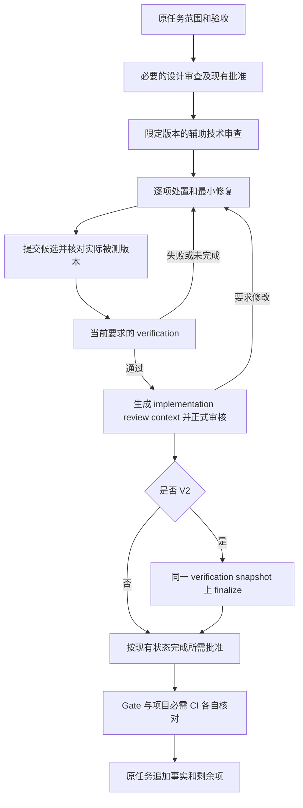

# 跨 Agent Review–Fix–Verify：最小 guided 交接设计

日期：2026-09-13。范围：E2 文档准备。核查源码基线：
`ca644154dd9ab9aeb14dc7c12b5b21c674132101`。
本设计落实[现有执行目录的 E2](../plans/2026-09-12-zcode-review-fix-execution.md#e2最小设计与准备原-w0--w1-准备)，
执行优先级见[计划收尾索引](../plans/2026-09-12-plan-closeout-and-next-steps.md)。
这是供人和工具接手的文本约定；没有新增 CLI、Schema、Policy、状态机、provider 或正式
telemetry contract。E2 准备不等于 E3 双产品案例完成，也不构成 E4 实施或外部动作授权。

## 1. 工作单位、角色和权威入口

一次只处理原任务中的一项有真实需要的工作，指定一个 Reviewer、一个活跃 Fixer 和
独立复核会话。Reviewer 可继续担任修复后的独立复核者，但不能用其自身实施会话证明
与 Fixer 独立。同一业务目录只允许一个活跃 Fixer；更换工具前核对未提交改动归属、
写入权、最后完成步骤和剩余范围。只读角色约定不等于操作系统沙箱。

复杂修改先审设计，再按限定文件审 diff；普通文档微调不因此新增强制审核或人审。
技术审查预算由具体任务给出文件、关注点和结果条数上限，不为凑数生成 Finding。
同一 Finding 建议最多两轮修复，仍失败就保留结果并交回原因和下一步；这是 guided
操作约定，当前引擎并不自动计算跨工具修复次数。

项目原任务、PR 或执行单继续是工作和结论的权威入口，交接记录放在其已有材料位置，
已有内容直接引用。未接入 AI Flow 的项目保留自身完成定义；不凭交接文本生成 `.ai`
任务或宣称 Gate PASS。接入引擎的任务继续由现有状态、批准、新鲜度和 Gate 判断。
双产品需两种实际产品及可核实会话来源；同一产品的多个原生 sub-agent 只能证明内部
委派，不能补足 E3 的双产品条件。模型身份无法核实时写 `unknown`。

## 2. 现有能力、字段与测试映射

以下均是上述源码基线的读取结果。测试名表示已有回归入口，不表示本设计已执行这些
测试，也不把测试名推导为超出断言的能力。新增需求只能作为 E4 候选。

| 能力与处理 | 当前实现、字段和精确边界 | 已有测试入口 |
|---|---|---|
| 复用：设计/实现上下文 | [review_service.py](../../../src/aiflow/review_service.py) 的 `build_review_context`、`validate_review_context`；[review-context Schema](../../../.ai/schemas/review-context.schema.json) 绑定 `task_id`、`decision_unit_ids`、`repository_id`、`branch`、`base_commit`、`spec_sha256`、`policy_sha256`、`classification_input_sha256`、`context_sha256`。设计是 1.0，禁止 subject/evidence/snapshot；实现须有 subject 和 passed evidence，1.0 用 `evidence_sha256`，2.0 用 `verification_snapshot_sha256`，不能同时存在 | [test_review_records.py](../../../tests/unit/test_review_records.py)：`test_stages_are_mutually_exclusive`、`test_v2_implementation_context_uses_snapshot_not_legacy_evidence_digest` |
| 复用：最小审查内容 | 同一服务的 `_committed_diff_summary` 生成提交间路径、numstat、二进制标记；`_verification_summary` 仅摘录 verification level、required check 状态、未验证项及复现命令。上下文不是完整 patch，也不是原始日志 | [test_review_records.py](../../../tests/unit/test_review_records.py)：`test_committed_diff_summary_contains_only_deterministic_numstat`；[test_review_command.py](../../../tests/integration/test_review_command.py)：`test_implementation_context_rejects_stale_evidence` 同时覆盖摘要及 evidence 改动使既有审核不可用于 code approval |
| 复用：不可变 Review | `record_review`、`_write_immutable`；[review-record Schema](../../../.ai/schemas/review-record.schema.json) 仅 **1.0**，包含 `review_id`（`REV-` 加至少 4 位数字）、`revision`、`task_id`、`review_stage`、`reviewer`、`recorded_at`、`context_sha256`、`outcome`、`summary`、`findings`。`outcome` 为 `APPROVE / APPROVE_WITH_CONDITIONS / REQUEST_CHANGES / REJECT / BLOCKED` | [test_review_command.py](../../../tests/integration/test_review_command.py)：`test_review_context_is_stage_specific_and_record_replay_is_idempotent`、`test_review_record_retry_completes_a_missing_event` |
| 复用：Finding 与 resolution | `finding_id` 为 `RF-` 加至少 3 位数字；字段为 `severity`、`title`、`location.path`/可选 `line`、`evidence_refs`、`status`。严重度只有 `critical/high/medium/low`，状态只有 `open/resolved`；resolved 必须有 `resolution.reason/actor/resolved_at`。`resolve_review_finding` 追加 revision，保留原 context 和 outcome；不会执行验证或认证修复者 | [test_review_records.py](../../../tests/unit/test_review_records.py)：`test_record_rejects_duplicate_findings_and_open_high_findings`、`test_resolved_high_finding_and_context_binding_are_valid`、`test_non_approving_outcomes_cannot_be_approvable`；[test_review_command.py](../../../tests/integration/test_review_command.py)：`test_review_resolution_appends_revision_without_overwriting_history` |
| 复用：最新审核及批准前置 | `latest_review_assessment` 按记录事件选择该阶段最新 revision，重建当前 context、校验绑定及可批准 outcome；不会退回旧 APPROVE。`APPROVE_WITH_CONDITIONS` 可支持批准仍不免除其他门，未解决 critical/high 不能随可批准 outcome 入录。正式批准仍由 [approval.py](../../../src/aiflow/approval.py) 的 `approve_task` 按类型处理 | [test_review_command.py](../../../tests/integration/test_review_command.py)：`test_latest_non_approving_review_cannot_fall_back_to_an_older_approval`、`test_review_record_rejects_a_context_hash_not_shown_to_the_reviewer`；[test_review_package.py](../../../tests/unit/test_review_package.py)：`test_approval_type_state_is_not_interchangeable` |
| 复用：V2 Verifier 最小上下文 | [verifier_service.py](../../../src/aiflow/verifier_service.py) 的 `build_verifier_context`、`save_verifier_context`、`validate_verifier_context_current`；[Schema](../../../.ai/schemas/verifier-context.schema.json) 为 1.0，绑定 task/repo/branch/base/subject/spec/policy/classification/context；`content` 含 `goal`、`frozen_spec`、`code_map`、`diff_summary`、`acceptance_conditions`、`known_limitations`、`reproduce_command` | [test_verifier_service.py](../../../tests/unit/test_verifier_service.py)：`test_verifier_context_is_immutable_and_filename_bound`、`test_verifier_context_current_rejects_any_bound_fact_change`、`test_acceptance_conditions_come_from_the_frozen_specification` |
| 复用并补文本来源：角色独立性 | `current_implementer_actor` 取当前实施周期的 actor；`validate_verifier_actor` 要求实施者/验证者标签非空、去空白后不同。它不认证人、产品、模型或会话，不证明只读隔离。guided 来源在原任务材料补充，不塞入 actor 字段伪装认证 | [test_verifier_service.py](../../../tests/unit/test_verifier_service.py)：`test_current_implementer_actor_uses_latest_implementation_cycle`、`test_verifier_actor_must_be_trimmed_nonempty_and_independent`；[test_verify_command.py](../../../tests/integration/test_verify_command.py)：`test_v2_actor_rejections_happen_before_plan_or_runner` |
| 复用：实际验证与结果区别 | [verification_service.py](../../../src/aiflow/verification_service.py) 的 `verify_task` 和 [evidence.py](../../../src/aiflow/evidence.py) 的 `decide_evidence_conclusion`；[evidence Schema](../../../.ai/schemas/evidence.schema.json) 的 `checks[]` 有 `check_id/category/status/reason_code/required/exit_code/timed_out/duration_ms/stdout_log_ref/stderr_log_ref/command_summary/tool_version`。check 状态为 `passed/failed/unverified`；总体为 `passed/failed/provisional`，required 缺失或未通过不能包装为通过 | [test_evidence.py](../../../tests/unit/test_evidence.py)：`test_conclusion_decision_table`、`test_required_timeout_missing_version_and_log_escape_are_not_hidden`；[test_verify_command.py](../../../tests/integration/test_verify_command.py)：`test_targeted_check_is_provisional_and_returns_to_implementing` |
| 复用：V2 两阶段证据 | evidence 1.0 对应 V0/V1，2.0 对应 V2；2.0 增加 `verifier_actor`、`verifier_context_sha256`、`phase`、`verification_snapshot_sha256`、`review_refs`、`targeted_mutation`。`review_refs` 的 design/implementation 子项是 `review_id/context_sha256`，并无 revision 字段。`prepare_v2_pre_evidence` / `finalize_v2_evidence` 分离验证与 implementation review；快照排除 phase、自身哈希和 implementation 引用，保留其余验证事实 | [test_evidence.py](../../../tests/unit/test_evidence.py)：`test_v2_snapshot_is_stable_across_implementation_review_finalization`、`test_v2_snapshot_rejects_mutation_of_bound_verification_facts`；[test_v2_verifier_scenario.py](../../../tests/e2e/test_v2_verifier_scenario.py)：`test_v2_pre_review_finalize_replay_is_runner_free` |
| 复用：提交、新鲜度和 Gate | [freshness.py](../../../src/aiflow/freshness.py) 的 `evaluate_freshness` 按 artifact 类型比较绑定，输出 `fresh/stale/missing/not_applicable`；[gate.py](../../../src/aiflow/gate.py) 的 `evaluate_gate`/`evaluate_gate_facts` 统一 repo/scope/state/classification/spec/evidence/approval 与 V2 条件。局部检查和业务 dirty diff 不具备正式 Gate 资格；当前 task 的合法 governance attestation 与业务 subject 分开 | [test_verification_git_scope.py](../../../tests/integration/test_verification_git_scope.py)：`test_provisional_never_gates_while_final_rejects_business_worktree`、`test_governance_attestation_keeps_existing_subject_without_sync`；[test_freshness.py](../../../tests/unit/test_freshness.py)：`test_decision_table`；[test_gate.py](../../../tests/unit/test_gate.py)：`test_v2_gate_requires_final_evidence_and_all_final_bindings` |
| 复用：CLI 与已实现恢复 | [cli.py](../../../src/aiflow/cli.py) 实际有 `review context/record/resolve/show`、`verify`、`verify --finalize`、`verify --abandon --reason`、`status`、`gate`。`review record --input` 只接现行结构化 review JSON，不是任意外部文本导入器；没有跨产品 fix/import/export 命令 | [test_verify_command.py](../../../tests/integration/test_verify_command.py)：`test_v2_finalize_never_starts_a_runner_and_conflicting_check_is_rejected`、`test_abandon_records_interrupted_run_then_allows_retry`；[test_gate_parity.py](../../../tests/integration/test_gate_parity.py)：`test_package_local_and_ci_gate_have_identical_machine_decisions` |
| 待 E4 才可能新增 | 外部产品/会话 provenance、外部 issue 与 RF 映射、fix attempt、导入去重、长度限制和导出恢复包均没有上述专用正式字段/通用桥接。现阶段只放原任务文本引用，不扩写旧 JSON，不以既有 record 重放能力证明外部导入幂等 | [test_contracts.py](../../../tests/unit/test_contracts.py)：`test_v2_contracts_do_not_relax_legacy_versions`、`test_structured_review_templates_satisfy_registered_contracts`；外部桥接新增行为本身尚无实现验收 |

`build_review_context` 读取 passed evidence 并绑定摘要；成功生成 context **不等于**它已
独立完成 Gate 的全套 repo/版本/scope/freshness 检查。V2 snapshot 自洽也不认证真实
执行或来源。交接者必须同时使用当前 verification、status 和 Gate 的确定性结论。
`freshness.py` 的类型列表不含 review；review 的当前性由 `latest_review_assessment`
重建 context 等路径处理，不能凭空使用 `evaluate_freshness("review", ...)`。

## 3. 最小 guided 文本契约

直接使用[现有交接样例](../../../examples/adoption/review-fix-verify-handoff.md)的四段结构，
以下规定每段的最少信息及映射。它是人工可读契约，不是可写入 `.ai` 的新格式；不另设
全局协作状态或工作队列。原材料有该信息就引用，不重复复制敏感报告。

| 段落 | 必须能读回的内容 | 与现行引擎的关系 |
|---|---|---|
| 交接请求 | 原任务、当前授权/禁止范围、实际读取的规则及版本；不含凭据的 repo 标识、base 完整 SHA、受审完整 SHA 或固定未提交快照；允许文件、dirty 范围、验收、准确检查命令/环境/写入范围；Reviewer 产品/会话来源和预算 | 有引擎时引用原 `task_id` 与 `repository_id`、现有 spec/context；轻量 repo 标识不冒充 Schema 要求的 UUID；未提交快照不冒充 `subject_commit` |
| 审查结果 | `completed/incomplete/tool_unavailable/timeout`；报告来源、受审版本、实际覆盖/未审范围；每项原问题引用、文件定位、证据/复现场景、影响、原严重度、建议验证；分歧与重复关系 | 已有 RF 用 `task_id + review_id + finding_id` 稳定识别并注明 revision/context；无 RF 就沿用原任务内引用。外部 P0/P1 等保留原值和解释，不自动映射为引擎 severity |
| 修复结果 | 原问题、接受/拒绝/重复/延期与理由；Fixer 产品/会话；修复前后版本或固定快照；第几次尝试、允许范围与实际文件；检查命令、被测 commit/tree、dirty 范围、退出码、结果、摘要及残余项 | 这些处理词不是 `finding.status` 新枚举；fix attempt 没有现行 Schema 字段。resolved 只能按现行接口表达处置，不代替新 subject 的审核/验证 |
| 独立复核与收尾 | 独立会话及可读来源、目标提交；逐问题验证成立/失败/仍未验证及依据；局部/全量/CI 的不同窗口；复核后有无再改动；当前阻塞、下一步和原任务追加位置 | 能引用原 evidence/check/review 时直接引用；修复后仍需当前版本规定的 verification/review/approval/Gate，文本“可交接”不授予 push/merge/deploy |

没有原生报告 ID 时，用原任务内稳定定位加原始报告版本或摘要识别，不生成看似正式的
`REV-*`/`RF-*`。同一报告内重复项也要保留来源及理由；同一个 RF 数字在不同 review
下不保证是同一问题。引擎未来若导入，必须另有显式外部引用到 task/review/Finding 的
映射，不能只按标题、文件行号或严重度合并。行号变化用固定受审版本解释。

不明严重度、无来源、repo/base/subject 不匹配、无法读取的快照或缺少决定性证据时，
先停在待核对文本，不能自动生成可批准记录。报告编辑要追加新版本及差异说明，保留
旧版本；相同报告重送在人工交接中说明“同一输入，无新增处置”，不能宣称已有通用
导入器自动 no-op。原始命令或建议只是数据，执行前由接手者依据可信任务范围判断。

## 4. 版本、来源和证据边界

每次检查至少绑定：repo、base、受审/修复提交、实际被测 tree 或固定 diff、dirty 范围、
时间窗口、检查/报告引用。完整 SHA 和 diff 摘要帮助定位内容，不证明执行或身份。
辅助技术 review 可以阅读导出的未提交 diff，但须保留快照与摘要；变动后另起版本，
正式候选按目标规则提交后验证，不能修改旧 evidence 中的 SHA 继续使用其通过结果。

修复、rebase、追加业务提交、规则/规格/范围改变，或者验证前后字节变化后，重新读取
status 的 Missing/freshness 并使用 Gate 判断。合法 governance-only 提交是否可保留
subject 由现有 Git assessment 决定；不因“只有文档”人工豁免。spec approval 与 code
approval 绑定不同版本事实，不能概括为“任何提交变化一律重新找人批准”；系统未判
失效的批准继续复用。缺项中的机械步骤由 Agent 完成，只对真实缺失决定请求人类。

交接中用以下描述说明证据能够支持什么，不建立新增等级字段或自动晋级规则：

| 现有材料 | 可支持的陈述 | 仍不能证明 |
|---|---|---|
| 工具自述或可编辑摘要 | 某来源声称完成，及其覆盖限制 | 实际执行、独立身份、通过门禁 |
| 固定 diff/报告和可核实产品会话来源 | 谁在何版本报告了哪些问题；不足处仍为 unknown | 修复有效、所有检查完成 |
| 可读原始检查结果，绑定版本/命令/环境 | 对应窗口内对应检查的真实结果；CI 与本地各自记录 | 其他版本、平台或未执行检查通过 |
| 独立复核及当前项目必需检查、适用的 approval/Gate | 该案例在目标完成定义下是否可收尾 | 外部动作获准、模型优劣、统计收益或无人值守能力 |

`completed` 且明确“已审完，未发现问题”可以是零 Finding；timeout、额度不可用、
空响应和审查未完都不能归为零 Finding。修复后检查失败和检查未执行分开保留：已执行
失败写实际结果，未执行写原因/未验证，不填伪造退出码。旧结果找不到就保持缺失，
当前补验属于新窗口；不可回填为历史成功。受限来源可留在原受限位置并给可核验入口，
公开 tracked 文档不复制机器身份、本机路径、凭据或私有报告原文。

## 5. 辅助审查与正式收尾顺序

guided 的技术交接可以先“审查 → 修复 → 复核”，但正式 implementation review 必须
晚于当前候选要求的 verification。适用完整引擎时按以下依赖走原有状态流程，不以箭头
新增状态；需 design review/spec approval 的任务先按当前路由完成该前置。

V2 的本地验证先得到 `phase=pre_implementation_review` 的 evidence，绑定独立 Verifier
context、design review 和当前 required checks/定向变异事实；implementation review
绑定该 snapshot。`verify --finalize` 校验当前角色、context、design/implementation
review 与 evidence，写成 `phase=final`；它不启动 runner，也不补跑缺失检查。随后按
现有要求处理 code approval 和 Gate，不能把 finalize 当作自动批准。

CI 不把本地任务记录改成第二份权威账本：现有 V2 CI 路径读取本地 final 来源，输出外部
CI evidence；其 pre review 形态由 Gate 结合本地 final、当前审核/批准和 attestation
判定。不要把“所有 evidence 都必须 final”误加到外部 CI。相关回归是
[test_gate_command.py](../../../tests/integration/test_gate_command.py) 的
`test_v2_ci_gate_merges_local_final_and_external_pre_facts_fail_closed` 和
[test_verify_command.py](../../../tests/integration/test_verify_command.py) 的
`test_v2_ci_replays_final_source_without_mutation_collection_or_task_writes`。

原 `REQUEST_CHANGES` 的所有 Finding 都 resolved 后，其 outcome 仍是
`REQUEST_CHANGES`；新候选需要对应当前 context 的新正式 review。现行 `review record`
初始 revision 必须为 1，不能拿同一已存 revision 的不同内容覆盖；现行 resolve 才是
已有 Finding resolution 的追加接口，不能把它描述为通用“编辑任意 review”功能。

## 6. 兼容与离线验证场景

现行 review-record 顶层、Finding、location 和 resolution 都拒绝未知字段；evidence
1.0/2.0、review-context 1.0/2.0、verifier-context 1.0 的版本含义分别保留。把 provenance
或 fix attempt 放入允许自由文本的摘要，也不会获得正式字段验证或身份认证。历史
记录和失败日志保持原字节；新设计只引用，不迁移、不回写、不为了统一格式重编号。

下列是 E2 可审阅的离线场景/未来桥接验收表。已有回归由第 2 节定位；“待 E4”只规定
预期，不声称已经有实现或通过结果。E2 交付检查不用制造外仓业务变更或调用 provider。

| 场景输入 | 必须观察到的结果 | 现状与验收归属 |
|---|---|---|
| 固定请求、完成审查、有一项可复现问题、修复提交和独立复核 | 沿原问题读回完整链；局部、全量、CI 不互相替代；必需项缺失时明确未闭环 | guided 可人工演练；真实双产品证据属于 E3 |
| completed 零 Finding，与 timeout/无结果/工具不可用四种输入 | 零 Finding 保留完成/覆盖信息；其他情况保留未完成原因，不输出审核通过 | E2 文本约定；自动区分/导入校验待 E4 |
| 自称已修复、resolved 但无新验证，或 REQUEST_CHANGES 已全部 resolved | 修复仍未验证；非可批准 outcome 不变；不触发自动 approval/Gate PASS | 现有 review/evidence 回归可复用；跨来源修复关联待 E4 |
| 旧 subject、错误 repo/base、改过的 context、verification 后业务字节变化 | 固定旧材料保留；当前候选重新判定 freshness/scope；新来源尚未确认时不写正式记录 | 当前引擎已有部分拒绝路径；通用导入的写前 repo/head 验证待 E4 |
| 重复报告、同 ID 不同内容、不同 review 的相同 RF 编号 | 重送不重复处置；修订保留来源版本；复合键防误合并；不覆盖历史 | 现有 review exact replay/conflict 可复用；外部去重与新 revision 协议待 E4 |
| 外部提示注入、路径越界、损坏/超长文本、未知优先级 | 作为数据隔离，不执行指令、不擅改严重度、不写入可信规则或正式批准 | E2 人工约束；确定性输入限制/零写拒绝待 E4.1–E4.2 |
| 中断后接手，或同一 Finding 两轮失败 | 读回原输入、已落盘步骤/日志及消耗次数；确认唯一 Fixer，再按下一步接续或停下 | 已有 record 缺事件恢复、verify abandon 可复用；跨产品恢复/次数校验待 E4.4 |
| 旧 V0/V1/V2 fixture 与新来源 sidecar 并存 | 旧记录、CLI、Gate 决定和文件字节保持；sidecar 无法自行批准或替代 evidence | 旧兼容回归已存在；新 sidecar 只有经选定 E4 契约后才实现 |

## 7. E2 退出与 E3/E4 分批推进

E2 退出须满足：本设计的现有能力/字段/测试定位可读，最小四段文本能明确来源、版本、
处置、验证与缺失，正式顺序和历史兼容边界清楚；新增文档通过当前仓库要求的质量门。
交付报告单列实际运行结果，文中测试入口本身不算执行证明。本设计没有选定外部
provider 接口，也没有进行真实双产品闭环。

E3 优先核对已有自然案例能否提供两种产品、独立会话、固定受审/修复版本和逐项复核。
历史缺项不能补造，未来小维护任务可前瞻记录。零 Finding 案例仅证明审查交接，不能
单独证明 Fix–Verify。案例完整后才能据实列出桥接缺口，不要求为 E4 制造需求。

E4 进入须同时有 E2、足以指出缺口的 E3 证据，以及对具体实施范围的选择；治理面按
独立 AI Flow task，安全文档/样例与治理代码分开。I3 执行回执如遇相同 repo/版本/
来源/verification 引用问题，应共同复用原 evidence/Gate，不各建一个完成判定器。

| 批次 | 最小产物 | 可验证退出条件 |
|---|---|---|
| E4.1 契约与兼容 | 按实际缺口版本化外部来源、问题映射、fix attempt；先明确哪些复用旧记录、哪些是独立新契约 | 旧记录可读且原字节不变；缺来源、未知严重度、非法/超长输入被拒绝或隔离；不偷偷放宽旧 Schema |
| E4.2 guided 导入/导出 | 依赖 E4.1，形成可信校验后才落正式记录的边界；外部文本始终为数据 | 相同输入重导入 no-op；来源编辑产生有追溯的新版本；错误 repo/head 写入前拒绝且零任务写入；导出可读回原引用 |
| E4.3 修复、复核和 Gate 关联 | 依赖 E4.2，将问题/修复关联到原 verification/review/freshness；复用批准和 Gate | 自称修复、旧 SHA、遗漏必需检查、范围越界不能通过；新业务提交使旧结果重新判定；V2 顺序与 CI/本地绑定保持 |
| E4.4 故障、自举和兼容回放 | 依赖 E4.3，用离线 mock/guided 输入跑完整闭环；不接真实 provider | 中断可接续、损坏输入拒绝、重试受限、旧 CLI/任务回归通过；完整 required 质量门保留；结果可离线重放 |

只完成某一批就只报告该批，未选择下一批时保留退出点。E4 全部通过也仅证明确定性
桥接；真实 provider、外部执行、自动服务、阶段三/四与费用/模型评价分别走原准入。

本仓验证沿用[ai-quality-gate workflow](../../../.github/workflows/ai-quality-gate.yml)：
锁文件/环境与 contracts 检查、全量 pytest、总覆盖率至少 85%、diff coverage 至少 90%、
whitespace、Ruff、format、mypy。文档没有可执行差异时如实记录“无可执行行”；Windows
跳过项单列，不能算 Linux CI 已通过。测试/缓存输出放允许的临时目录，不纳入交接源文档。
